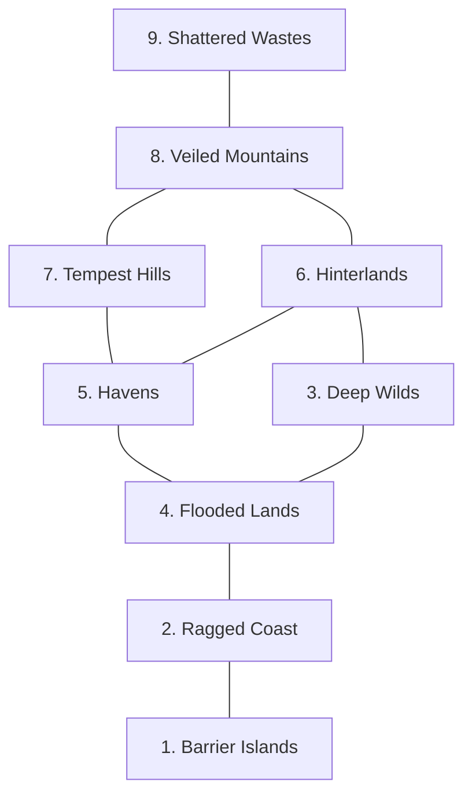

# REGIONS OF THE IRONLANDS
______________________________________________________________________

The Ironlands is divided into several distinct regions, each with its own character, geography, and dangers.

### [ MAP INDEX ]

***
**112 | CHAPTER 4 | YOUR WORLD**
***

## 1. BARRIER ISLANDS

### [ FEATURES ]
| | |
| :--- | :--- |
| • Crashing waves and treacherous currents | • Gliding seabirds |
| • Jagged rocks hidden just beneath the surface | • Decaying wrecks of wooden ships |
| • Snow-dappled cliffs jutting out of the sea | • Fisher-folk braving the wild sea |
| • Low clouds and curling mists | • Lurking seaborne raiders |
| • Ferocious winds | |

This long string of islands parallels the Ragged Coast. They are beautiful, but imposing. The slate-gray cliffs rise dramatically out of the water, topped by treeless moors. Waterfalls, fed by persistent rains, plunge over these cliffs into the raging sea. The winds are fierce and ever-present. In the winter, sleet, snow, and ocean mist can cut visibility to the length of one's arm.

The islands are sparsely populated by Ironlanders, mostly fisher-folk who brave the surrounding waters. Their settlements cling to narrow, rock-strewn shores or lie on high overlooks. At night, the dim lights of their fires and torches glimmer pitifully against the wild, storm-tossed sea.

> [!TIP]
> **Quest Starter:** The spectral maiden appears at the bow of your ship, offering to guide you safely through the storm—for a price. What does she demand of you?

***

***

## 2. RAGGED COAST

### [ FEATURES ]
| | |
| :--- | :--- |
| • Narrow fjords | • Raiders sounding the drums of war |
| • Settlements built on rocky shores | • Schools of orca gliding through the waves |
| • Trade ships flying colorful sails | • Monstrous serpents rising from depths |
| • Shipbuilders hammering at wooden hulls | |

This coast is marked by massive fjords. It is a rugged land of snow-capped cliffs overlooking blue waters.

Ironlander settlements are located at the head of the fjords in the shelter of narrow valleys. From there, both fisher-folk and raiders set sail. Their kin gather to see them off, laying wreaths of spruce in their wake.

In the center of each settlement, at the front of the longhouse, a stack of rune-marked river stones memorialize those who did not return—one stone for each of the lost.

> [!TIP]
> **Quest Starter:** A ship which set off from a coastal settlement is found washed up on shore. It is empty. This ship carried something of great importance, now lost. What was it, and why do you swear to recover it?

***
**114 | CHAPTER 4 | YOUR WORLD**

***

## 3. DEEP WILDS

### [ FEATURES ]
| | |
| :--- | :--- |
| • Unbroken woodland | • Ancient trees hung with moss |
| • A thick canopy casts the floor in shadow | • Streams winding through rough terrain |
| • Lingering fog | • Skittering and growls from the mist |
| • Constant rains | • Elves, ever watchful |

The Deep Wilds are a vast swath of ancient forest. The ground is a lush carpet of ferns and lichens. The gnarled branches are cloaked in hanging moss. The air is almost perpetually misty and wet. Unlike the bordering regions, heavy snow is rare here. Instead, there is the ceaseless patter of rain dripping from high boughs and the rush of river over rock. The air carries the earthy smells of damp and decay.

A few Ironlanders live along the fringes of the Deep Wilds, taking advantage of the relatively temperate climate and abundant game. However, most avoid this region. This is a land of the firstborn, of monstrous beasts, of horrors that defy description. This is the world before humans.

> [!TIP]
> **Quest Starter:** An Ironlander has sided with an enemy in the heart of the Wilds, and is leading attacks against Ironlander settlements. Who is this person? Who have they joined forces with? What will you do to stop these attacks?

***

***

## 4. FLOODED LANDS

### [ FEATURES ]
| | |
| :--- | :--- |
| • Fetid wetlands | • Beguiling ghostlights |
| • Dead trees poisoned by salt water | • Biting insects |
| • Networks of sluggish rivers | • Creatures beneath the surface |
| • Ponds and lakes shrouded in mist | |

This is a low-lying region of bogs, swamps, lakes, and slow-moving rivers. Near the coast, the water is salty and riddled with dead trees. Further north, the morass of forested wetlands and bogs is interspersed with rare patches of higher ground. Through it all, twisting rivers make their sluggish journey to the sea. The smell of these lands is rotten and dank. It is the smell of slow death.

A few hardy Ironlanders live here in small settlements built atop hillocks, or in homes standing on stilts over the wetlands. Most fish and forage, making their way among the waterways on flat-bottomed boats propelled by long poles. Some dig through peat for bog iron—a cold, wet, grueling task.

Travel is precarious here. One step has you on solid ground. The next sends you plunging through a thin layer of peat into a murky bog. Then, bony hands reach out to you, grasping, pulling. "Stay with me," a voice whispers. "Stay with me here in the dark."

> [!TIP]
> **Quest Starter:** Rising flood waters threaten to overwhelm an Ironlander settlement. Escape by boat is the only option, but there are few boats and many people. What's more, there is something hungry in the water, waiting to feed.

***
**116 | CHAPTER 4 | YOUR WORLD**

***

## 5. HAVENS

### [ FEATURES ]
| | |
| :--- | :--- |
| • Rolling hills and rocky bluffs | • Verdant heaths |
| • Pockets of dense wood | • Wide rivers navigated by boatmen |
| • Walled settlements | • Long, harsh winters |

This is an expansive region of forests, rivers, shrubland, and low hills. After an arduous journey, after untold losses, the first Ironlander settlers looked upon the Havens as a fresh start—a relative oasis in a fierce, uncaring land. It gave them hope.

Years later, that hope is fading. Even within the Havens, there is little rest or safety. The winters are long. The harvests are never enough. Raiders strike without mercy. The thick woods, deep rivers and dark nights hold secrets and lurking horrors. Some say the Ironlands is a living thing, a malevolent spirit, intent on ridding itself of the human invaders. Slowly, season by season, year by year, it is succeeding.

The Ironlander settlements in this region typically stand on hills or at the confluence of rivers. The buildings are made of wood, or sometimes stone, with roofs covered in turf. The central homes and communal structures are protected by an outer palisade fashioned from earth and wood. Outside these walls, from spring through autumn, farmers work the meager fields. In winter, the settlements are smothered by deep snow and oppressive gray clouds.

> [!TIP]
> **Quest Starter:** A settlement has fallen under the unjust rule of a cruel leader. What leverage do they hold over these people? What is your connection to the community? What can be done to overthrow this tyrant?

***

***

## 6. HINTERLANDS

### [ FEATURES ]
| | |
| :--- | :--- |
| • Dense forests vs rugged terrain | • Hunter camps and remote settlements |
| • Sudden, unsettling stillness | • Ironlanders foraging and hunting |
| • Hungry beasts, stalking | • Varou bands, howling war songs |

This high terrain consists of a long string of forested hills. Isolated Ironlander settlements in this region serve primarily as bases for hunters and trappers. A few farmers do the best they can with the rocky soil, but the people depend mostly on meat, mushrooms, berries, and other bounties from the forest to sustain them during the long winters.

Those winters are bitter and harsh. Snow gathers as deep as an Ironlander is tall, or more. Hunters, cloaked in heavy furs, wear snowshoes to navigate across the rough terrain. At night, they make camp. They drink and tell stories. They try to ward away the encroaching darkness with a blazing fire. They cast nervous glances at sounds just beyond the light.

In the spring and summer, the melting snow feeds tumultuous rivers. The forests burst with rich life. But, always there is a chill in the air. Always there is a reminder of the coming winter.

> [!TIP]
> **Quest Starter:** A group of Ironlanders have been forced out of their Hinterland settlement. What caused them to leave? With winter coming, and food in short supply, will you attempt to reclaim their settlement or convince someone to take them in?

***
**118 | CHAPTER 4 | YOUR WORLD**

***

## 7. TEMPEST HILLS

### [ FEATURES ]
| | |
| :--- | :--- |
| • Stunted forests | • Howling winds |
| • Mist-shrouded waterfalls | • Mining settlements |
| • Nomad encampments on plateaus | • Caravans hauling bounties of ore |
| • Wary giants keeping distance | • Mammoths grazing in meadows |

These highlands are defined by rugged hills and low mountains, thin conifer woods, and wide, grassy plateaus, leading up to the heights of the Veiled Mountains. Through most seasons, the constant ill-winds break against the sides of the hills, screeching and moaning. In the dead of winter, some say these winds carry the names of those fated to die during the long cold season.

Nomadic Ironlanders live among the hills, herding livestock. In the spring and summer they move among high pastures. In the winter, they find some relief from the brutal weather in sheltered valleys. Others live in mining settlements, drawing iron ore from riverbeds and shallow digs. Their furnaces, sending up plumes of black smoke, convert the ore into wrought iron, which is sent south for trade with the Havens.

> [!TIP]
> **Quest Starter:** You have come across or learned of a rich source of unclaimed iron and silver among these hills. What hazards must be overcome before a mine can be established? What force opposes you or attempts to establish its own claim?

***

***

## 8. VEILED MOUNTAINS

### [ FEATURES ]
| | |
| :--- | :--- |
| • Massive peaks in roiling clouds | • Howling beasts |
| • Endless snows | • Precarious mountain trails |
| • Stone cairns, marking the dead | • Abandoned settlements |
| • Circling wyverns | |

Commonly referred to as the Veils, these great mountains mark the northern bounds of the settled lands. They are almost perpetually shrouded in cloud, snow, and mist. On the rare day they are visible to those Ironlanders far south in the Havens, the sight of the towering peaks is enough to inspire a mix of fear and awe.

For a few, that feeling is a call rather than a warning. The Ironlanders who dwell here are mostly members of small mining communities. They seek fortunes in iron or silver, but often find only death in the endless, brutal cold. Even those who manage to eke out some sort of life among the Veils are sure to head south before the onset of winter. Before the long dark takes hold.

> [!TIP]
> **Quest Starter:** As winter fast approaches, there is no sign of the Ironlanders who live in a small mining community on the flanks of the Veils. They should have been off the mountain weeks ago. Time is running out.

***
**120 | CHAPTER 4 | YOUR WORLD**

***

## 9. SHATTERED WASTES

### [ FEATURES ]
| | |
| :--- | :--- |
| • Vast fields of broken ice | • Discomforting stillness |
| • Deep crevasses | • Piercing cold |
| • Unnatural horrors breaking ice | |

To the north of the Veiled Mountains lies the Shattered Wastes, a plain of jagged, broken ice. No one knows the bounds of this land or what lies beyond. No Ironlanders dwell here, and only a handful have explored the passage into the Wastes through the Veils. Those who survived the journey returned with stories of unimaginable cold and things moving beneath the ice.

> [!TIP]
> **Quest Starter:** The traveler returned from his journey into the Shattered Wastes with dead, frostbitten hands and extraordinary stories. The others scoff at him, but you believe. Why? What does he tell you? What compels you to see for yourself?

***
