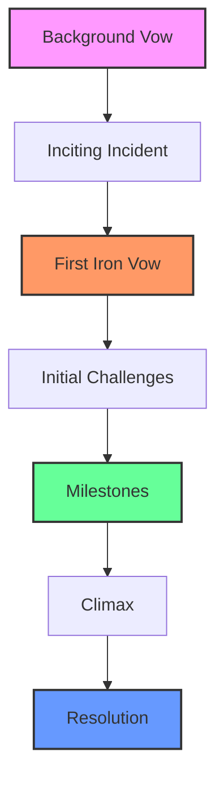

# STARTING YOUR CAMPAIGN

## CREATE YOUR CHARACTER

When you begin a campaign of Ironsworn, the first step is to create your character. This process is detailed in Chapter 2, but here's a quick overview:

1. **Envision Your Character**: Think about who your character is, what drives them, and what brought them to this point in their life.
2. **Choose Your Stats**: Distribute points among your three stats: Edge, Heart, and Iron.
3. **Set Your Health, Spirit, and Supply**: These start at their maximum values.
4. **Select Your Background**: Choose from the various backgrounds available, which will inform your starting bonds and vows.
5. **Choose Your Starting Assets**: Select the equipment and abilities that define your character's capabilities.

> **💡 Character Creation Tip**: Take time to think about your character's history and motivations. This will make your roleplaying experience more engaging and provide rich material for future adventures.

## CREATE YOUR WORLD

The Ironlands are a harsh, unforgiving land, but they're also shaped by your choices. As you begin your campaign:

1. **Review the Regions**: Familiarize yourself with the different regions of the Ironlands (Chapter 4)
2. **Define Your Truths**: Choose or randomize the truths that define your version of the Ironlands
3. **Establish Your Starting Location**: Decide where your character's story begins

```
╔══════════════════════════════════════════════════════════════╗
║                    THE IRONLANDS AWAIT                       ║
║  A land of harsh winters, ancient ruins, and untamed wilds   ║
║  Where iron is power, and survival is never guaranteed       ║
╚══════════════════════════════════════════════════════════════╝
```

## MARK YOUR BACKGROUND BONDS

Your character has connections to the world and the people in it. These bonds represent:

- **People**: Family, friends, mentors, or rivals
- **Places**: Your home, a significant location, or a territory you know well
- **Ideals**: Beliefs, causes, or principles that drive you

Mark these bonds on your character sheet. They'll be important for:
- Gaining bonuses on relevant moves
- Creating narrative hooks for future adventures
- Defining your character's place in the world

## WRITE YOUR BACKGROUND VOW

Every Ironsworn character begins with a background vow - a significant commitment that defines their current situation. This vow should:

- Be **personal** and meaningful to your character
- Have **clear stakes** - what happens if you succeed or fail?
- Be **achievable** but challenging
- Connect to your bonds and background

### Examples of Background Vows:
- *"I will find my missing brother who disappeared in the Deep Wilds"*
- *"I must clear my family's name of the false accusations that drove us from our home"*
- *"I will uncover the source of the strange corruption plaguing my village"*

## ENVISION YOUR INCITING INCIDENT

What event pushes your character to action *right now*? This inciting incident:

- **Immediate**: It's happening now or just happened
- **Compelling**: It forces your character to make difficult choices
- **Connected**: It relates to your background vow and bonds

### Inciting Incident Ideas:
- A messenger arrives with urgent news
- Your settlement faces an unexpected threat
- You discover something that changes everything
- A promise must be kept, no matter the cost

## SET THE SCENE

Before you begin playing, take a moment to establish:

- **Where** you are exactly
- **When** this is taking place (season, time of day)
- **What** the immediate environment looks like
- **Who** is present (if anyone)
- **Why** you're here in this moment

> **🎭 Setting the Scene**: Use descriptive language to paint a vivid picture. Think about the sights, sounds, and smells of your location.

## SWEAR AN IRON VOW

Once you have your character, world, and inciting incident, it's time to swear your first Iron vow. This vow will drive your initial adventures.

When you **Swear an Iron Vow**:
1. State what you vow to accomplish
2. Mark progress on the vow track
3. Consider the challenge rank (Troublesome, Dangerous, Formidable, Extreme, or Epic)

The vow should be:
- **Specific**: Clear and well-defined
- **Challenging**: Not easily accomplished
- **Meaningful**: Important to your character and the story

## NEXT STEPS

With your campaign setup complete, you're ready to begin playing. Your first moves should:

1. **Face the immediate situation** created by your inciting incident
2. **Gather information** about your vow and the challenges ahead
3. **Make plans** and take your first steps toward fulfilling your vow

## CREATING A QUEST OUTLINE

While Ironsworn is designed for emergent storytelling, having a loose quest outline can help guide your early adventures:



### Quest Elements to Consider:
- **Key Locations**: Where will important events take place?
- **Supporting Characters**: Who might help or hinder your quest?
- **Potential Obstacles**: What challenges stand in your way?
- **Twists and Turns**: What unexpected developments might occur?

## CAMPAIGN SETUP SUMMARY

✅ **Character Created**: Stats, assets, and background defined  
✅ **World Established**: Ironlands truths and starting location set  
✅ **Bonds Marked**: Connections to people, places, and ideals noted  
✅ **Background Vow Written**: Personal commitment established  
✅ **Inciting Incident Envisioned**: Immediate situation defined  
✅ **Scene Set**: Current circumstances established  
✅ **Iron Vow Sworn**: First major quest undertaken  
✅ **Quest Outline Considered**: Basic story structure planned  

---

*"The Ironlands do not suffer the weak, but they reward the bold. Your vow is sworn. Your path is chosen. Now, begin your journey."*
