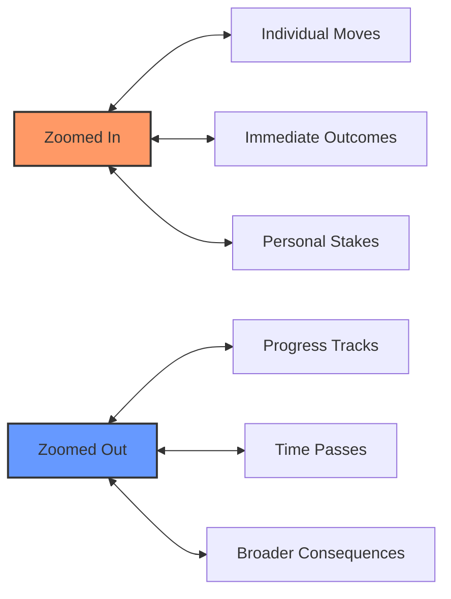

# THE MECHANICS AND THE FICTION

## LEADING AND FOLLOWING WITH THE FICTION

In Ironsworn, the relationship between game mechanics and fictional narrative is a dance. Each leads and follows in turn, creating a dynamic storytelling experience.

### The Fiction Leads
When you describe what your character does, you're setting the scene for the mechanics. Your fictional actions determine:
- **Which moves are triggered** by your character's intentions
- **What stats apply** to the situation
- **How success or failure** manifests in the story

> **🎭 Example**: If you say, "I carefully search the ancient ruins for clues," you're setting up a Gather Information move with an emphasis on careful observation.

### The Mechanics Lead
When dice are rolled and outcomes determined, the mechanics guide the fiction:
- **Success levels** (strong hit, weak hit, miss) shape what happens next
- **Progress boxes** mark the tangible advancement of your goals
- **Momentum shifts** reflect the changing fortunes of your character

```
╔══════════════════════════════════════════════════════════════╗
║                      THE FICTION-MECHANICS CYCLE              ║
╠══════════════════════════════════════════════════════════════╣
║  Fiction → Mechanics → Fiction → Mechanics → Fiction → ...   ║
║     ↓           ↓            ↓           ↓            ↓      ║
║  Action →   Dice Roll →  Outcome →  Narrative →  New Action  ║
╚══════════════════════════════════════════════════════════════╝
```

## FICTIONAL FRAMING

How you frame your fictional actions has a direct impact on the mechanics and the story that unfolds.

### Be Specific and Clear
When you declare your action:
- **State your intent**: What are you trying to accomplish?
- **Describe your approach**: How are you doing it?
- **Consider the context**: What tools, conditions, or factors apply?

### Good Framing Examples:
✅ *"I draw my iron dagger and try to disarm the bandit by striking their wrist"*  
✅ *"I use my knowledge of herbs to search for medicinal plants in this forest"*  
✅ *"I climb the rocky cliff face, testing each handhold before putting my full weight on it"*

### Poor Framing Examples:
❌ *"I fight the guy"*  
❌ *"I look for stuff"*  
❌ *"I succeed"*

### The Power of Fictional Details
Specific details in your narration can:
- **Justify bonus dice** from your assets or circumstances
- **Create opportunities** for interesting complications
- **Make the story more memorable** and engaging
- **Provide hooks** for future developments

> **💡 Narration Tip**: Think like a storyteller, not a game player. Describe what your character does, feels, and thinks, not just what game mechanic you're using.

## REPRESENTING DIFFICULTY

Ironsworn represents challenge through several mechanical systems, each tied to the fiction.

### Challenge Ranks
When you swear a vow or face a significant obstacle, assign a challenge rank:

| Rank | Progress Boxes | Fictional Meaning |
|------|----------------|-------------------|
| **Troublesome** | 6 boxes | A minor challenge, easily overcome |
| **Dangerous** | 8 boxes | A significant threat, requires effort |
| **Formidable** | 10 boxes | A major obstacle, real risk of failure |
| **Extreme** | 12 boxes | A daunting challenge, success is unlikely |
| **Epic** | 12 boxes + 2 damage | A legendary feat, nearly impossible |

### Progress as Fiction
Each progress box represents meaningful advancement:
- **Research**: Discovering crucial information
- **Exploration**: Mapping dangerous territory
- **Social**: Winning allies or influencing people
- **Combat**: Gaining advantage in extended conflicts

### Momentum and Difficulty
Your momentum score interacts with difficulty:
- **High momentum** can make challenges feel easier
- **Negative momentum** makes even simple tasks harder
- **Burning momentum** represents pushing yourself beyond normal limits

## ZOOMING IN AND OUT

Ironsworn allows you to adjust the "zoom level" of your storytelling, focusing on different scales of action and consequence.

### Zoomed In: Detailed Action
When you zoom in, focus on:
- **Specific moves** and their immediate outcomes
- **Individual actions** and their direct results
- **Personal stakes** and immediate consequences

**Example**: 
> *You carefully pick the lock on the chest. The tumblers click into place one by one. With a final turn of your dagger, the lock opens with a soft click.*

### Zoomed Out: Extended Action
When you zoom out, cover:
- **Longer time periods** (days, weeks, months)
- **Multiple actions** condensed into progress
- **Broader consequences** and story developments

**Example**:
> *Over the next week, you systematically search the abandoned library. Each day brings new discoveries, and by week's end, you've uncovered the ritual's location.*

### Using Progress Tracks for Zoom
Progress tracks help manage zoomed-out action:
- **Mark progress** after significant efforts
- **Make progress rolls** when time passes or major efforts are made
- **Reset tracks** when objectives are completed or abandoned

### When to Zoom
**Zoom In** for:
- Climactic moments
- Critical decisions
- Complex challenges
- Character development

**Zoom Out** for:
- Travel and journeys
- Extended research
- Long-term projects
- Montage sequences



## BALANCING MECHANICS AND NARRATIVE

The key to satisfying Ironsworn play is finding the right balance between mechanical resolution and narrative flow.

### Let Mechanics Serve the Story
- Use dice rolls to **create surprises**, not just determine success
- Let **misses and complications** drive interesting developments
- Treat **mechanical outcomes** as story prompts, not final judgments

### Let Story Inform Mechanics
- Use **fictional positioning** to justify bonuses or penalties
- Let **character choices** determine which moves are available
- Allow **narrative needs** to influence challenge ranks and difficulty

### The Golden Rule
> **The story always comes first.** Mechanics are tools to help tell that story, not constraints that limit it.

When in doubt, ask: *"What makes for the most interesting story?"* - then use the mechanics to help make that story happen.

---

*"In the Ironlands, fate and choice intertwine. The dice may fall where they will, but it is your actions - your story - that gives those falls meaning."*
