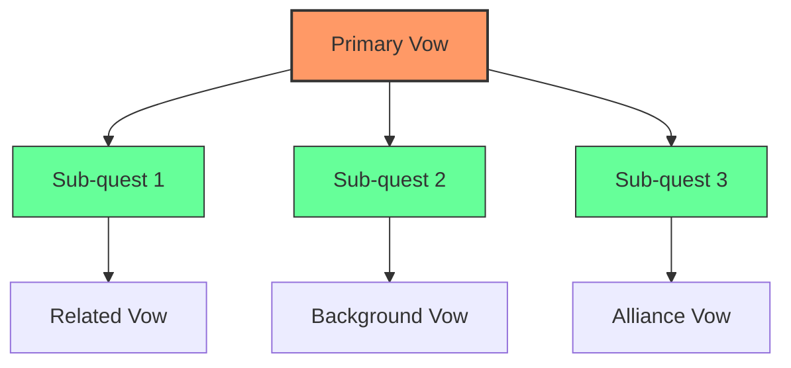
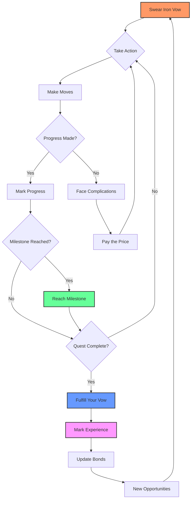

# MANAGING YOUR QUESTS

## REACHING MILESTONES

As you work toward fulfilling your vows, you'll achieve significant milestones along the way. These represent major breakthroughs in your quest.

### What Counts as a Milestone?
A milestone is a **significant accomplishment** that moves you substantially closer to your goal. Examples include:

- **Discovery**: Finding the location of the ancient artifact
- **Alliance**: Securing the help of a powerful ally
- **Overcoming**: Defeating a major obstacle or enemy
- **Insight**: Uncovering crucial information that changes your approach
- **Progress**: Completing a significant portion of your journey

### Marking Milestones
When you **Reach a Milestone**:
1. **Mark 2 boxes** on your vow's progress track
2. **Reset your momentum** to +0 (if it was negative)
3. **Take a moment** to acknowledge your achievement

> **🎯 Milestone Tip**: Don't mark milestones for minor accomplishments. Save them for truly significant moments that feel like breakthroughs in your story.

### Milestone Frequency
- **Troublesome vows**: 1-2 milestones
- **Dangerous vows**: 2-3 milestones  
- **Formidable vows**: 3-4 milestones
- **Extreme/Epic vows**: 4+ milestones

```
╔══════════════════════════════════════════════════════════════╗
║                    QUEST MILESTONE TRACK                     ║
╠══════════════════════════════════════════════════════════════╣
║  [ ] [ ] [ ] [ ] [ ] [ ] [ ] [ ] [ ] [ ] [ ] [ ]           ║
║  ▲   ▲   ▲   ▲   ▲   ▲   ▲   ▲   ▲   ▲   ▲   ▲              ║
║  │   │   │   │   │   │   │   │   │   │   │   │              ║
║  Start           Milestone 1    Milestone 2    Complete     ║
╚══════════════════════════════════════════════════════════════╝
```

## UNDERTAKING NEW QUESTS

As you progress through your adventures, you'll discover new challenges and opportunities that lead to additional vows.

### When to Start New Quests
Consider swearing a new vow when:
- **Current quest reveals** a larger problem
- **New threats emerge** that require attention
- **Opportunities arise** that align with your character's goals
- **Allies request help** with their own quests
- **The story naturally branches** into new directions

### Managing Multiple Vows
You can have **multiple active vows**, but consider:

- **Focus**: Don't spread yourself too thin
- **Priority**: Which vows are most urgent or important?
- **Connection**: How do your quests relate to each other?
- **Resources**: Do you have the momentum and assets to pursue multiple goals?

### Vow Types and Relationships


## FULFILLING YOUR VOW

When you've filled the progress track for a vow, it's time to **Fulfill Your Vow** and see your quest through to its conclusion.

### The Fulfillment Move
When you **Fulfill Your Vow**, roll +the vow's challenge rank:

| Roll Result | Outcome |
|-------------|---------|
| **Strong Hit** | You fulfill your vow and achieve your goal. Mark experience and choose one: +1 momentum, or mark 2 boxes on a bond track |
| **Weak Hit** | You fulfill your vow, but with a complication. Mark experience and choose one: -1 momentum, or suffer -1 supply |
| **Miss** | You do not fulfill your vow. You may try again, but first you must **Pay the Price** |

### Celebrating Success
When you fulfill a vow:
- **Mark experience** for your character's growth
- **Update your bonds** - some may strengthen, others may change
- **Consider the impact** on your character and the world
- **Look ahead** to new challenges and opportunities

### When Vows Go Wrong
If you fail to fulfill a vow:
- **Learn from the experience** - what went wrong?
- **Consider the consequences** - how does this failure affect you?
- **Decide whether to try again** or abandon the quest
- **Swear a new vow** to address the situation if needed

## FORGING NEW BONDS

Your adventures will bring you into contact with new people, places, and ideals. These connections become bonds that strengthen your character and open new story possibilities.

### Types of New Bonds
- **People**: Allies, mentors, rivals, or enemies you encounter
- **Places**: Locations that become important to your story
- **Ideals**: New beliefs or causes that inspire you

### When to Forge Bonds
Consider forging a new bond when:
- **Someone helps you** significantly
- **You spend significant time** in a location
- **You adopt a new belief** or cause
- **A relationship evolves** from casual to meaningful
- **The story demands** an ongoing connection

### Marking New Bonds
When you forge a new bond:
1. **Write it down** on your character sheet
2. **Consider its nature** - positive, negative, or complex
3. **Think about its potential** for future stories
4. **Mark progress** if appropriate to the relationship

## ADVANCING YOUR CHARACTER

As you complete quests and overcome challenges, your character grows in experience and capability.

### Gaining Experience
You mark experience when you:
- **Fulfill a vow** (any result)
- **Reach a milestone** in a quest
- **Face death** and survive
- **Endure significant hardships** and persevere

### Using Experience
When you have 3 experience marks:
1. **Clear all experience marks**
2. **Choose one advancement**:
   - Increase one stat by +1
   - Add a new asset
   - Upgrade an existing asset
   - Learn a new ability

### Character Growth Arcs
Think about your character's development:
- **Skills**: What new abilities have they gained?
- **Knowledge**: What have they learned about the world?
- **Relationships**: How have their connections evolved?
- **Identity**: How have they changed as a person?

## QUEST FLOW CHART



## QUEST MANAGEMENT TIPS

### Stay Organized
- **Track multiple vows** with clear notes
- **Update progress** after each significant action
- **Review bonds** regularly to keep them relevant

### Keep Momentum
- **Focus on one or two main quests** at a time
- **Use milestones** to maintain momentum between sessions
- **Balance challenge and achievement** for engagement

### Embrace the Journey
- **Let quests evolve** naturally from the story
- **Don't force completion** if the story leads elsewhere
- **Value the experience** as much as the destination

---

*"Every vow sworn is a story waiting to be told. Every milestone reached is a victory earned. Every bond forged is a connection that lasts beyond the quest itself."*
