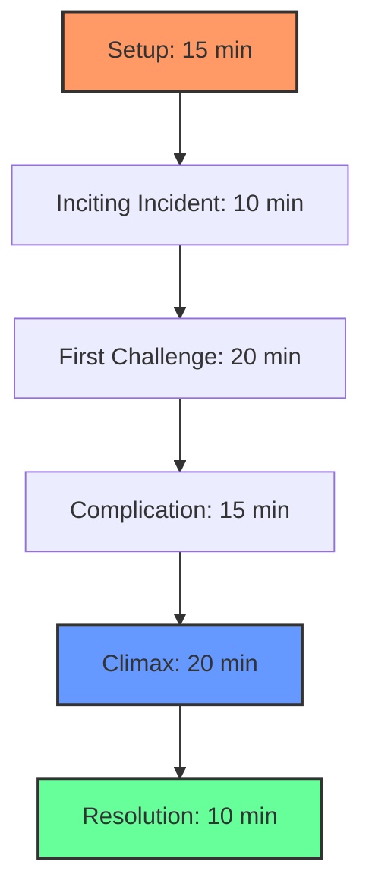
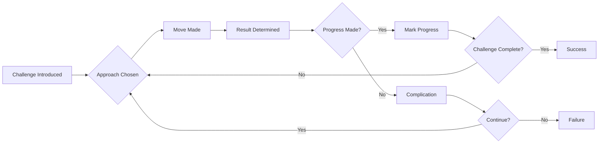

# GAMEPLAY OPTIONS

## NUMBER OF PLAYERS

Ironsworn is flexible and can accommodate different group sizes, each offering a unique experience.

### Solo Play
Playing Ironsworn by yourself offers complete creative control and personal storytelling.

**Advantages:**
- **Total freedom** - you control every aspect of the story
- **Your own pace** - play as quickly or slowly as you want
- **Deep immersion** - complete focus on your character's journey
- **Flexible scheduling** - play whenever you have time

**Challenges:**
- **Self-motivation** - you must drive the story forward
- **Objectivity** - balancing challenge and success
- **Creativity** - generating all the narrative content
- **Maintaining momentum** - keeping the story engaging

**Solo Play Tips:**
- Use the oracle frequently to introduce surprises
- Keep a journal of your adventures
- Create supporting NPCs to interact with
- Set regular play sessions to maintain consistency

### Co-op Play (2-3 Players)
Small group play combines individual storytelling with collaborative elements.

**Advantages:**
- **Shared creativity** - build on each other's ideas
- **Character interaction** - meaningful relationships between PCs
- **Mutual support** - help each other overcome challenges
- **Shared worldbuilding** - create the Ironlands together

**Challenges:**
- **Coordination** - aligning schedules and play styles
- **Spotlight balance** - ensuring everyone gets attention
- **Pacing** - managing different character arcs
- **Conflict resolution** - handling disagreements

**Co-op Structure:**
```
╔══════════════════════════════════════════════════════════════╗
║                      CO-OP PLAY MODEL                        ║
╠══════════════════════════════════════════════════════════════╣
║  Player 1: Primary Quest + Supporting Role                   ║
║  Player 2: Primary Quest + Supporting Role                   ║
║  Player 3: Primary Quest + Supporting Role                   ║
║  Shared: Joint Quests + World Events                        ║
╚══════════════════════════════════════════════════════════════╝
```

### Guided Play (3+ Players)
Traditional RPG structure with one player acting as Game Master.

**Advantages:**
- **Clear structure** - GM provides direction and challenges
- **Rich world** - GM can develop deep lore and NPCs
- **Dynamic challenges** - GM can adapt to player choices
- **Shared experience** - collaborative storytelling

**Challenges:**
- **GM preparation** - requires significant planning
- **Player dependency** - relies on GM's availability
- **Power dynamics** - balancing GM authority with player agency
- **Pacing complexity** - managing multiple character stories

## ONE-SHOT PLAY

Ironsworn can be played in single-session adventures, perfect for trying out the system or telling complete short stories.

### Designing One-Shots
**Keep it focused:**
- **Single objective** - one clear goal for the session
- **Limited scope** - don't try to tell an epic
- **Pre-generated characters** - quick start, no lengthy creation
- **Clear stakes** - immediate, obvious consequences

**One-Shot Structure:**


### One-Shot Scenarios
**Classic One-Shot Ideas:**
- **The Rescue Mission** - Save someone from immediate danger
- **The Mystery** - Solve a crime or uncover a secret
- **The Survival Challenge** - Endure a harsh environment
- **The Defense** - Protect a settlement from threat
- **The Recovery** - Retrieve an important object

### Quick Start Rules
For one-shots, consider these simplifications:
- **Skip background vows** - start with the main quest
- **Simplified bonds** - focus on immediate relationships
- **Starting momentum** - begin with +2 momentum
- **Reduced consequences** - less permanent harm

## OPPOSING AN ALLY

Sometimes, characters may find themselves in conflict. Here's how to handle opposed actions between player characters.

### When to Use Opposed Rolls
Consider opposed rolls when:
- **Characters want different outcomes** that can't both happen
- **Direct competition** for limited resources or opportunities
- **Ideological conflict** that requires action to resolve
- **Physical confrontation** between player characters

### The Opposed Roll Mechanic
When characters oppose each other:

1. **Both players make the same move**, using appropriate stats
2. **Compare results**:
   - **Strong hit vs. Miss**: Winner achieves their goal
   - **Weak hit vs. Miss**: Winner succeeds with complication
   - **Strong hit vs. Weak hit**: Winner succeeds, loser gets partial success
   - **Weak hit vs. Weak hit**: Both succeed with complications
   - **Strong hit vs. Strong hit**: Both succeed dramatically

### Managing PvP Conflict
**Keep it collaborative:**
- **Focus on the story** - not "winning" against another player
- **Communicate intentions** - discuss desired outcomes
- **Accept consequences** - be willing to lose gracefully
- **Find the interesting middle** - compromise often creates better stories

**Conflict Resolution Framework:**
```
╔══════════════════════════════════════════════════════════════╗
║                    CONFLICT RESOLUTION                       ║
╠══════════════════════════════════════════════════════════════╣
║  1. Discuss stakes - What does each character want?          ║
║  2. Choose mechanics - How will you resolve this?            ║
║  3. Make the rolls - Let the dice decide                     ║
║  4. Tell the story - What happens as a result?              ║
║  5. Move forward - How does this change things?             ║
╚══════════════════════════════════════════════════════════════╝
```

## SCENE CHALLENGES

Scene challenges provide structured ways to handle complex situations that require multiple actions and approaches.

### What Are Scene Challenges?
Scene challenges represent:
- **Complex obstacles** that can't be overcome with one move
- **Extended conflicts** requiring multiple approaches
- **Environmental hazards** that persist over time
- **Social situations** with multiple factors to consider

### Setting Up Scene Challenges
**Define the challenge:**
- **Clear objective** - what must be accomplished
- **Multiple approaches** - different ways to contribute
- **Progress tracking** - how to measure advancement
- **Time pressure** - why this matters now

**Scene Challenge Structure:**


### Types of Scene Challenges
**Physical Challenges:**
- **Climbing a mountain** - endurance, skill, equipment
- **Crossing a chasm** - engineering, bravery, teamwork
- **Navigating a maze** - perception, memory, logic

**Social Challenges:**
- **Negotiating peace** - diplomacy, empathy, leverage
- **Winning support** - persuasion, reputation, evidence
- **Investigating a crime** - investigation, intuition, authority

**Mental Challenges:**
- **Solving a puzzle** - intelligence, creativity, patience
- **Resisting influence** - willpower, focus, support
- **Learning a secret** - research, observation, insight

### Running Scene Challenges
**For GMs:**
- **Describe the situation** clearly and vividly
- **Offer multiple approaches** - don't funnel players
- **Respond to creativity** - reward innovative solutions
- **Escalate tension** - raise stakes as progress is made

**For Players:**
- **Coordinate actions** - work together effectively
- **Use different strengths** - let each character shine
- **Adapt to complications** - be flexible in your approach
- **Think narratively** - describe actions vividly

## SEMI-RANDOM CAMPAIGN SETUP

For those who want to jump into play quickly, use these semi-random setup methods.

### Quick Character Generation
**Roll for background:**
1. **Stat array** - roll 2d6+6 for each stat, assign as desired
2. **Background** - roll on a table for character history
3. **Starting vow** - roll for quest type and target
4. **Starting bonds** - roll for relationships
5. **Starting location** - roll on region tables

**Character Setup Tables:**
| d6 | Background | Starting Vow Type |
|----|------------|-------------------|
| 1  | Hunter     | Explore           |
| 2  | Warrior    | Combat            |
| 3  | Mystic     | Discover          |
| 4  | Raider     | Acquire           |
| 5  | Outcast    | Survive           |
| 6  | Leader     | Protect           |

### World Generation
**Roll for truths:**
- **Old World** - What was left behind?
- **Communities** - How do people live?
- **Mysticism** - Is magic real?
- **Horrors** - What lurks in the dark?

**Quick Start Truths:**
```
╔══════════════════════════════════════════════════════════════╗
║                    QUICK START TRUTHS                        ║
╠══════════════════════════════════════════════════════════════╣
║  The Old World is forgotten, its ruins dot the landscape     ║
║  Communities are isolated, struggling to survive             ║
║  Mysticism is rare, feared but powerful                      ║
║  Horrors are real, born of ancient corruption                ║
╚══════════════════════════════════════════════════════════════╝
```

### Adventure Hooks
**Roll for immediate situation:**
| d10 | Current Situation |
|-----|------------------|
| 1-2 | Under attack by raiders |
| 3-4 | Strange illness spreading |
| 5-6 | Ancient discovery made |
| 7-8 | Political turmoil brewing |
| 9-10 | Natural disaster threatening |

---

*"These options are tools, not rules. Use them to enhance your Ironsworn experience, adapt them to your needs, and create the stories that matter to you and your fellow players."*
