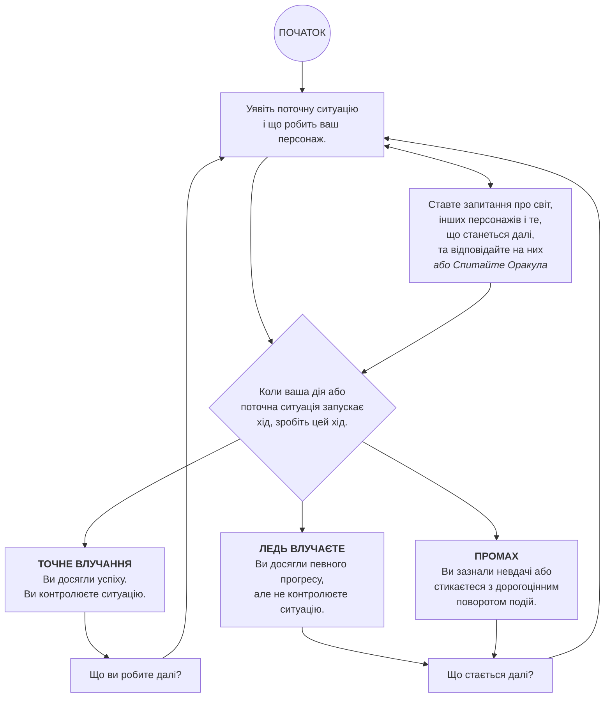

# ПРОЦЕС ГРИ

Як і в більшості рольових ігор, ви граєте переважно від імені свого персонажа. Що ви робите? Чого намагаєтеся досягти? З яким опором і викликами ви стикаєтесь? Ваші присяги, а також персонажі та ситуації, з якими ви зустрічаєтесь, будуть спрямовувати фікшен та ваші вибори.

Коли у вас виникають запитання про те, що ви знаходите, як реагують інші персонажі у вашому світі або що станеться далі, ви можете діяти так, як вважаєте за потрібне (якщо граєте соло або кооперативно), або запитати свого ведучого. Коли ви шукаєте натхнення або хочете віддати ситуацію в руки долі, ви робите хід *Спитати Оракула* [сторінка 107](3-Moves_7-Fate-Moves.md#спитати-оракула). Використовуйте запитання "так/ні" та випадкові підказки, щоб генерувати цікаві повороти і нові ускладнення, про які ви могли й не подумати самостійно. Перш за все, якщо це цікаво, драматично і відповідає фікшену — зробіть так, щоб це сталося.

Якщо ви робите щось, що охоплюється певним ходом, зверніться до цього ходу, щоб вирішити наслідки своєї дії. Якщо він каже вам кинути граники — зробіть це.

Точне влучання на ході означає, що ви контролюєте ситуацію. Ви керуєте наративом. Що ви робите далі?

Ледь влучаєте або промах означає, що ви не контролюєте ситуацію. Замість того, щоб діяти, ви реагуєте. Що стається далі? Якщо ви граєте з ведучим, він визначить, як відреагує світ. В іншому випадку, ви покладаєтеся на свою інтуїцію і періодичні кидки оракула, щоб рухати історію.

---

## ПРОЦЕС ГРИ (БЛОК-СХЕМА)

---
