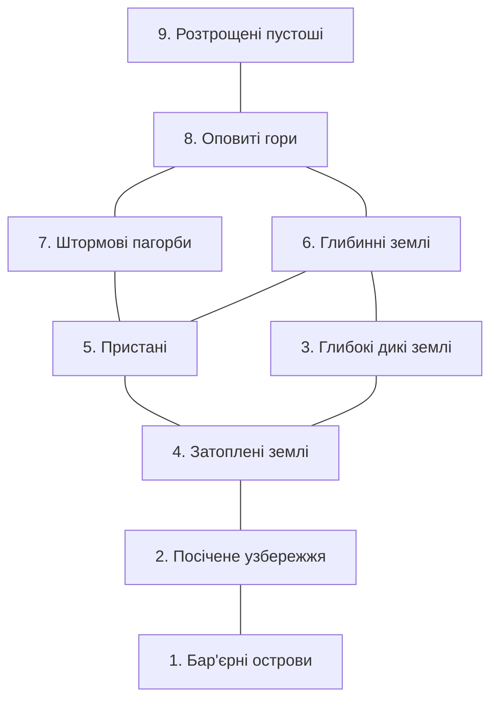

# РЕГІОНИ ЗАЛІЗНИХ ЗЕМЕЛЬ
______________________________________________________________________

Залізні Землі поділені на кілька окремих регіонів, кожен зі своїм характером, географією та небезпеками.

### [ ІНДЕКС КАРТИ ]

***
**112 | РОЗДІЛ 4 | ВАШ СВІТ**
***

## 1. БАР'ЄРНІ ОСТРОВИ

### [ ОСОБЛИВОСТІ ]
| | |
| :--- | :--- |
| • Хвилі, що розбиваються, та підступні течії | • Морські птахи, що ширяють у небі |
| • Гострі скелі, приховані прямо під поверхнею | • Гниючі залишки дерев'яних кораблів |
| • Вкриті плямами снігу скелі, що виступають з моря | • Рибалки, які кидають виклик дикому морю |
| • Низькі хмари та закручені тумани | • Морські нападники, що ховаються в засідці |
| • Люті вітри | |

Цей довгий ланцюг островів тягнеться паралельно до Посіченого узбережжя. Вони красиві, але вселяють страх. Шиферно-сірі скелі драматично здіймаються з води, увінчані безлісими пустищами. Водоспади, що живляться безперервними дощами, спадають з цих скель у бурхливе море. Вітри тут люті та постійні. Взимку мокрий сніг і океанський туман можуть знизити видимість до довжини простягнутої руки.

Острови малонаселені Залізоземцями, переважно рибалками, які наважуються виходити в навколишні води. Їхні поселення чіпляються за вузькі, вкриті камінням береги або лежать на високих оглядових майданчиках. Вночі тьмяне світло їхніх багать і смолоскипів жалюгідно мерехтить на тлі дикого, розбурханого штормом моря.

> [!TIP]
> **Початок пригоди:** Примарна діва з'являється на носі вашого корабля, пропонуючи безпечно провести вас крізь шторм — за певну ціну. Чого вона вимагає від вас?

***

***

## 2. ПОСІЧЕНЕ УЗБЕРЕЖЖЯ

### [ ОСОБЛИВОСТІ ]
| | |
| :--- | :--- |
| • Вузькі фіорди | • Нападники б'ють у бойові барабани |
| • Поселення, збудовані на скелястих берегах | • Зграї косаток, що ковзають крізь хвилі |
| • Торговельні кораблі, що ходять під кольоровими вітрилами | • Монструозні змії, що піднімаються з глибин |
| • Кораблебудівники, що б'ють молотами по дерев'яних корпусах | |

Це узбережжя посічене масивними фіордами. Це суворий край засніжених скель, що височіють над синіми водами.

Поселення Залізоземців розташовані в гирлах фіордів під захистом вузьких долин. Звідти відпливають як рибалки, так і нападники. Їхні родичі збираються, щоб провести їх, кидаючи смерекові вінки у їхній кільватер.

У центрі кожного поселення, перед довгим будинком, купа позначеного рунами річкового каміння вшановує пам'ять тих, хто не повернувся — по одному каменю для кожного загиблого.

> [!TIP]
> **Початок пригоди:** Корабель, що відплив від прибережного поселення, знаходять викинутим на берег. Він порожній. Цей корабель перевозив щось дуже важливе, нині втрачене. Що це було, і чому ви дали присягу повернути це?

***
**114 | РОЗДІЛ 4 | ВАШ СВІТ**

***

## 3. ГЛИБОКІ ДИКІ ЗЕМЛІ

### [ ОСОБЛИВОСТІ ]
| | |
| :--- | :--- |
| • Непрохідні ліси | • Прадавні дерева, обвішані мохом |
| • Густий купол гілок, що кидає тінь на землю | • Струмки, що звиваються крізь пересічену місцевість |
| • Туман, що затримується між дерев | • Шарудіння та гарчання з туману |
| • Безперервні дощі | • Ельфи, які завжди напоготові |

Глибокі дикі землі — це величезна смуга прадавнього лісу. Земля тут — це пишний килим з папороті та лишайників. Вузлуваті гілки вкриті звисаючим мохом. Повітря майже завжди туманне та вологе. На відміну від прилеглих регіонів, сильні снігопади тут рідкість. Натомість тут постійно чути барабанення дощу, що капає з високих гілок, і шум річки, яка тече по камінню. У повітрі відчуваються землисті запахи вогкості та гниття.

Деякі Залізоземці живуть на узліссях Глибоких диких земель, користуючись перевагами відносно помірного клімату та великою кількістю дичини. Проте більшість уникає цього регіону. Це земля первородних, монструозних звірів і жахів, які не піддаються опису. Це світ до появи людей.

> [!TIP]
> **Початок пригоди:** Залізоземець став на бік ворога в серці Диких земель і керує нападами на поселення Залізоземців. Хто ця людина? З ким вони об'єднали сили? Що ви зробите, щоб зупинити ці напади?

***

***

## 4. ЗАТОПЛЕНІ ЗЕМЛІ

### [ ОСОБЛИВОСТІ ]
| | |
| :--- | :--- |
| • Смердючі болота | • Оманливі примарні вогні |
| • Мертві дерева, отруєні солоною водою | • Кусючі комахи |
| • Мережі повільних річок | • Істоти під поверхнею води |
| • Ставки та озера, вкриті туманом | |

Це низинний регіон трясовин, боліт, озер і повільних річок. Біля узбережжя вода солона і всіяна мертвими деревами. Далі на північ трясовина заліснених боліт чергується з рідкісними ділянками твердої землі. Крізь усе це звивисті річки повільно торують свій шлях до моря. Запах цих земель гнилий і вогкий. Це запах повільної смерті.

Кілька витривалих Залізоземців живуть тут у невеликих поселеннях, побудованих на пагорбах, або в будинках, що стоять на палях над болотами. Більшість займається риболовлею та збиральництвом, пересуваючись водними шляхами на плоскодонних човнах, відштовхуючись довгими жердинами. Деякі добувають болотне залізо в торфі — це холодна, волога, виснажлива праця.

Подорожувати тут небезпечно. Один крок — і ви на твердій землі. Наступний — відправляє вас під воду крізь тонкий шар торфу в каламутне болото. Тоді кістляві руки тягнуться до вас, хапають, тягнуть. "Залишся зі мною," — шепоче голос. "Залишся зі мною тут, у темряві."

> [!TIP]
> **Початок пригоди:** Води повені, що піднімаються, загрожують затопити поселення Залізоземців. Втеча на човнах — єдиний варіант, але човнів мало, а людей багато. До того ж, у воді є щось голодне, що чекає на поживу.

***
**116 | РОЗДІЛ 4 | ВАШ СВІТ**

***

## 5. ПРИСТАНІ

### [ ОСОБЛИВОСТІ ]
| | |
| :--- | :--- |
| • Пологі пагорби та скелясті кручі | • Зелені пустища |
| • Острівці густого лісу | • Широкі річки, якими плавають човнярі |
| • Обнесені стінами поселення | • Довгі, суворі зими |

Це розлогий регіон лісів, річок, чагарників та низьких пагорбів. Після виснажливої подорожі, після незліченних втрат, перші поселенці Залізоземців подивилися на Пристані як на новий початок — своєрідну оазу в суворій, байдужій землі. Вона дала їм надію.

Через роки ця надія згасає. Навіть у Пристанях мало відпочинку чи безпеки. Зими тут довгі. Врожаю завжди не вистачає. Нападники завдають ударів без пощади. Густі ліси, глибокі річки та темні ночі приховують таємниці та невидимі жахи. Дехто каже, що Залізні Землі — це жива істота, злий дух, що має намір позбутися людських загарбників. Повільно, сезон за сезоном, рік за роком, йому це вдається.

Поселення Залізоземців у цьому регіоні зазвичай стоять на пагорбах або на злитті річок. Будинки збудовані з дерева або іноді з каменю, з дахами, вкритими дерном. Центральні будинки та громадські споруди захищені зовнішнім частоколом, зробленим із землі та дерева. За межами цих стін, з весни до осені, фермери обробляють мізерні поля. Взимку поселення засипані глибоким снігом і вкриті гнітючими сірими хмарами.

> [!TIP]
> **Початок пригоди:** Поселення опинилося під несправедливою владою жорстокого лідера. Які важелі впливу він має на цих людей? Який ваш зв'язок зі спільнотою? Що можна зробити, щоб повалити цього тирана?

***

***

## 6. ГЛИБИННІ ЗЕМЛІ

### [ ОСОБЛИВОСТІ ]
| | |
| :--- | :--- |
| • Густі ліси на тлі пересіченої місцевості | • Табори мисливців і віддалені поселення |
| • Раптова, тривожна тиша | • Залізоземці, що займаються збиральництвом і полюванням |
| • Голодні звірі, що переслідують здобич | • Ватаги вару, що виють бойові пісні |

Ця височина складається з довгого ланцюга заліснених пагорбів. Ізольовані поселення Залізоземців у цьому регіоні служать переважно базами для мисливців і звіроловів. Кілька фермерів роблять усе можливе з кам'янистим ґрунтом, але люди здебільшого залежать від м'яса, грибів, ягід та інших дарів лісу, щоб прогодувати себе протягом довгих зим.

Ці зими гіркі та суворі. Снігу намітає по пояс Залізоземцю, а то й більше. Мисливці, загорнуті у важкі хутра, носять снігоступи, щоб орієнтуватися на пересіченій місцевості. Вночі вони розбивають табір. Вони п'ють і розповідають історії. Вони намагаються відігнати темряву, що насувається, за допомогою палаючого багаття. Вони кидають нервові погляди на звуки, що лунають якраз за межею світла.

Навесні та влітку танення снігу живить бурхливі річки. Ліси вибухають багатим життям. Але в повітрі завжди відчувається холодок. Завжди є нагадування про прийдешню зиму.

> [!TIP]
> **Початок пригоди:** Групу Залізоземців витіснили з їхнього поселення у Глибинних землях. Що змусило їх піти? З наближенням зими і нестачею їжі, чи спробуєте ви відвоювати їхнє поселення, чи переконаєте когось прийняти їх до себе?

***
**118 | РОЗДІЛ 4 | ВАШ СВІТ**

***

## 7. ШТОРМОВІ ПАГОРБИ

### [ ОСОБЛИВОСТІ ]
| | |
| :--- | :--- |
| • Низькорослі ліси | • Виючі вітри |
| • Оповиті туманом водоспади | • Шахтарські поселення |
| • Табори кочівників на плато | • Каравани, що перевозять руду |
| • Обережні велетні, що тримаються на відстані | • Мамонти, що пасуться на луках |

Ці високогір'я визначаються нерівними пагорбами та низькими горами, рідкими хвойними лісами і широкими трав'янистими плато, що ведуть до вершин Оповитих гір. Протягом більшої частини сезонів постійні злі вітри розбиваються об схили пагорбів, верещачи і стогнучи. Дехто каже, що в глуху зиму ці вітри несуть імена тих, кому судилося померти під час довгого холодного сезону.

Кочові Залізоземці живуть серед пагорбів, випасаючи худобу. Навесні та влітку вони переміщуються по високогірних пасовищах. Взимку вони знаходять певний порятунок від жорстокої погоди в захищених долинах. Інші живуть у шахтарських поселеннях, видобуваючи залізну руду з русел річок і неглибоких розкопів. Їхні печі, що випускають шлейфи чорного диму, перетворюють руду на коване залізо, яке відправляють на південь для торгівлі з Пристанями.

> [!TIP]
> **Початок пригоди:** Ви натрапили на багате джерело нічийного заліза та срібла серед цих пагорбів або дізналися про нього. Які небезпеки потрібно подолати, перш ніж можна буде заснувати шахту? Яка сила протистоїть вам або намагається заявити свої права на неї?

***

***

## 8. ОПОВИТІ ГОРИ

### [ ОСОБЛИВОСТІ ]
| | |
| :--- | :--- |
| • Масивні вершини у вируючих хмарах | • Виючі звірі |
| • Безкінечні сніги | • Небезпечні гірські стежки |
| • Кам'яні каїрни, що позначають мертвих | • Покинуті поселення |
| • Віверни, що кружляють у небі | |

Ці великі гори, які в народі називають Пеленою, позначають північні межі заселених земель. Вони майже завжди оповиті хмарами, снігом і туманом. У той рідкісний день, коли вони видимі для тих Залізоземців, що живуть далеко на півдні у Пристанях, вигляду високих вершин достатньо, щоб викликати суміш страху та благоговіння.

Для декого це відчуття є радше закликом, аніж попередженням. Залізоземці, які живуть тут, здебільшого є членами невеликих шахтарських спільнот. Вони шукають багатства в залізі чи сріблі, але часто знаходять лише смерть у безкінечному, жорстокому холоді. Навіть ті, кому вдається якось вижити серед Пелени, обов'язково вирушають на південь до настання зими. До того, як запанує довга темрява.

> [!TIP]
> **Початок пригоди:** З наближенням зими немає жодних звісток від Залізоземців, які живуть у невеликому шахтарському поселенні на схилах Пелени. Вони мали б спуститися з гори ще кілька тижнів тому. Час спливає.

***
**120 | РОЗДІЛ 4 | ВАШ СВІТ**

***

## 9. РОЗТРОЩЕНІ ПУСТОШІ

### [ ОСОБЛИВОСТІ ]
| | |
| :--- | :--- |
| • Величезні поля розбитого льоду | • Тривожна тиша |
| • Глибокі тріщини | • Пронизливий холод |
| • Неприродні жахи, що проламують лід | |

На північ від Оповитих гір лежать Розтрощені пустоші, рівнина із зубчастого, розбитого льоду. Ніхто не знає меж цієї землі або того, що лежить за нею. Жоден Залізоземець тут не живе, і лише одиниці досліджували прохід у Пустоші через Пелену. Ті, хто вижив у подорожі, повернулися з розповідями про неймовірний холод і речі, що рухаються під льодом.

> [!TIP]
> **Початок пригоди:** Мандрівник повернувся з подорожі до Розтрощених пустошей з мертвими, обмороженими руками та неймовірними історіями. Інші насміхаються з нього, але ви йому вірите. Чому? Що він вам розповідає? Що спонукає вас переконатися в цьому на власні очі?

***