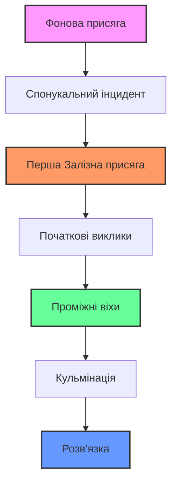

# ПОЧАТОК ВАШОЇ КАМПАНІЇ

## СТВОРЕННЯ ПЕРСОНАЖА

Коли ви починаєте кампанію в Ironsworn, першим кроком є створення вашого персонажа. Цей процес детально описано в Розділі 2, але ось короткий огляд:

1. **Уявіть свого персонажа**: Подумайте про те, ким є ваш персонаж, що ним рухає і що привело його до цього моменту в його житті.
2. **Виберіть свої характеристики**: Розподіліть бали між трьома характеристиками: Вістря, Серце та Залізо.
3. **Встановіть здоров'я, дух та припаси**: Вони починаються зі своїх максимальних значень.
4. **Оберіть свою передісторію**: Виберіть із доступних варіантів минулого, що вплине на ваші початкові стосунки та присяги.
5. **Оберіть свої початкові активи**: Виберіть спорядження та здібності, які визначають можливості вашого персонажа.

> **💡 Порада щодо створення персонажа**: Знайдіть час, щоб подумати про історію та мотиви вашого персонажа. Це зробить ваш рольовий досвід більш захоплюючим і забезпечить багатий матеріал для майбутніх пригод.

## СТВОРЕННЯ ВАШОГО СВІТУ

Залізні Землі — це суворий, безжальний край, але він також формується вашими виборами. Розпочинаючи кампанію:

1. **Ознайомтеся з регіонами**: Дізнайтеся більше про різні регіони Залізних Земель (Розділ 4).
2. **Визначте свої Істини**: Виберіть або випадковим чином визначте істини, які формують вашу версію Залізних Земель.
3. **Встановіть початкову локацію**: Вирішіть, де починається історія вашого персонажа.

```
╔══════════════════════════════════════════════════════════════╗
║                    ЗАЛІЗНІ ЗЕМЛІ ЧЕКАЮТЬ                     ║
║  Край суворих зим, стародавніх руїн та неприборканої глуші   ║
║  Де залізо — це влада, а виживання ніколи не гарантоване     ║
╚══════════════════════════════════════════════════════════════╝
```

## ВІДМІТЬТЕ ВАШІ ФОНОВІ СТОСУНКИ

У вашого персонажа є зв'язки зі світом та людьми в ньому. Ці стосунки представляють:

- **Людей**: Сім'ю, друзів, наставників або суперників.
- **Місця**: Ваш дім, важливе місце або територію, яку ви добре знаєте.
- **Ідеали**: Переконання, цілі або принципи, які вами керують.

Відмітьте ці стосунки на аркуші персонажа. Вони будуть важливі для:
- Отримання бонусів до відповідних ходів.
- Створення наративних зачіпок для майбутніх пригод.
- Визначення місця вашого персонажа у світі.

## НАПИШІТЬ СВОЮ ФОНОВУ ПРИСЯГУ

Кожен персонаж Ironsworn починає з фонової присяги — значного зобов'язання, яке визначає його поточну ситуацію. Ця присяга повинна:

- Бути **особистою** та важливою для вашого персонажа.
- Мати **чіткі ставки** — що станеться, якщо ви досягнете успіху чи зазнаєте невдачі?
- Бути **досяжною**, але складною.
- Бути пов'язаною з вашими стосунками та минулим.

### Приклади фонових присяг:
- *"Я знайду свого зниклого брата, який розчинився у Глибоких диких землях"*
- *"Я маю очистити ім'я своєї родини від неправдивих звинувачень, через які нас вигнали з дому"*
- *"Я знайду джерело дивної скверни, що мучить моє село"*

## УЯВІТЬ СВІЙ СПОНУКАЛЬНИЙ ІНЦИДЕНТ

Яка подія спонукає вашого персонажа до дії *саме зараз*? Цей спонукальний інцидент:

- **Негайний**: Він відбувається зараз або щойно стався.
- **Переконливий**: Він змушує вашого персонажа робити складний вибір.
- **Пов'язаний**: Він стосується вашої фонової присяги та стосунків.

### Ідеї для спонукальних інцидентів:
- Прибуває посланець з терміновими новинами.
- Ваше поселення стикається з несподіваною загрозою.
- Ви дізнаєтесь щось таке, що змінює все.
- Обіцянку потрібно виконати за будь-яку ціну.

## ВСТАНОВІТЬ СЦЕНУ

Перш ніж почати грати, знайдіть хвилину, щоб визначити:

- **Де** саме ви знаходитесь.
- **Коли** це відбувається (сезон, час доби).
- **Як** виглядає безпосереднє оточення.
- **Хто** присутній (якщо хтось є).
- **Чому** ви тут саме в цей момент.

> **🎭 Встановлення сцени**: Використовуйте описову мову, щоб намалювати яскраву картину. Подумайте про вигляд, звуки та запахи вашого оточення.

## ДАТИ ЗАЛІЗНУ ПРИСЯГУ

Коли у вас є персонаж, світ та спонукальний інцидент, настав час дати першу залізну присягу. Ця присяга керуватиме вашими початковими пригодами.

Коли ви **Даєте залізну присягу**:
1. Заявіть, що ви присягаєтесь зробити.
2. Відмітьте прогрес на шкалі присяги.
3. Подумайте про ранг виклику (Клопітний, Небезпечний, Грізний, Екстремальний або Епічний).

Присяга має бути:
- **Конкретною**: Чіткою та добре визначеною.
- **Складною**: Не такою, що її легко виконати.
- **Значимою**: Важливою для вашого персонажа та історії.

## НАСТУПНІ КРОКИ

Завершивши налаштування кампанії, ви готові почати грати. Ваші перші ходи повинні:

1. **Зустріти безпосередню ситуацію**, створену вашим спонукальним інцидентом.
2. **Зібрати інформацію** про вашу присягу та виклики попереду.
3. **Побудувати плани** та зробити перші кроки до виконання присяги.

## СТВОРЕННЯ СТРУКТУРИ КВЕСТУ

Хоча Ironsworn розроблено для емерджентного (непередбачуваного) розвитку сюжету, наявність вільної структури квесту може допомогти спрямувати ваші перші пригоди:



### Елементи квесту для обміркування:
- **Ключові локації**: Де відбуватимуться важливі події?
- **Допоміжні персонажі**: Хто може допомогти чи завадити вашому завданню?
- **Потенційні перешкоди**: Які виклики стоять на вашому шляху?
- **Повороти сюжету**: Які несподівані події можуть статися?

## ПІДСУМОК НАЛАШТУВАННЯ КАМПАНІЇ

✅ **Створено персонажа**: Визначено характеристики, активи та минуле  
✅ **Створено світ**: Встановлено Істини Залізних Земель та початкову локацію  
✅ **Відмічено стосунки**: Вказано зв'язки з людьми, місцями та ідеалами  
✅ **Написано фонову присягу**: Встановлено особисте зобов'язання  
✅ **Уявлено спонукальний інцидент**: Визначено безпосередню ситуацію  
✅ **Встановлено сцену**: Описано поточні обставини  
✅ **Дано залізну присягу**: Розпочато перше головне завдання  
✅ **Обмірковано структуру квесту**: Сплановано базову структуру історії  

---

*"Залізні Землі не терплять слабких, але вони винагороджують сміливих. Ваша присяга дана. Ваш шлях обрано. Тепер, починайте свою подорож."*