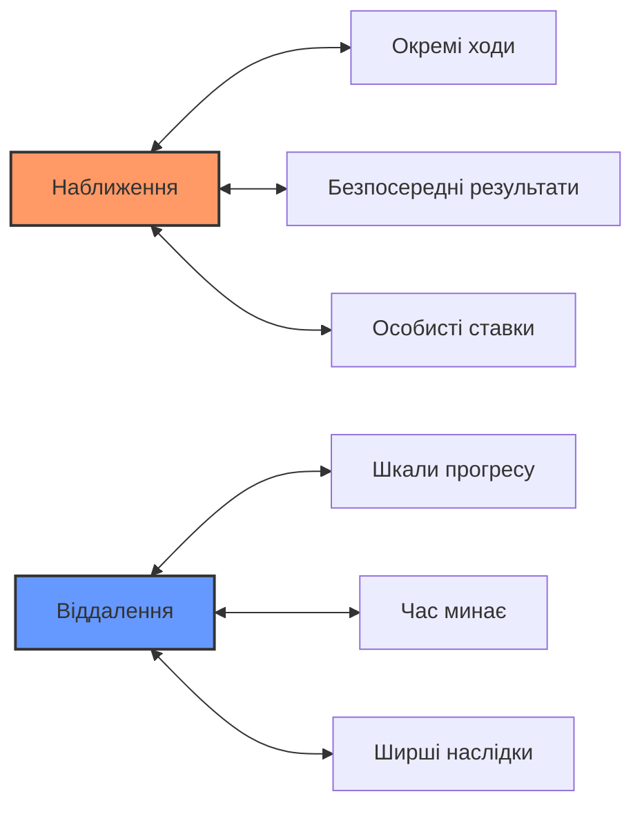

# МЕХАНІКА ТА ФІКШЕН

## ВЕДЕННЯ ТА СЛІДУВАННЯ ЗА ФІКШЕНОМ

В Ironsworn взаємозв'язок між ігровою механікою та вигаданим наративом нагадує танець. Кожен з них по черзі веде та слідує, створюючи динамічний досвід розповіді історій.

### Фікшен веде
Коли ви описуєте, що робить ваш персонаж, ви встановлюєте сцену для механіки. Ваші вигадані дії визначають:
- **Які ходи активуються** намірами вашого персонажа.
- **Які характеристики застосовуються** до ситуації.
- **Як успіх чи невдача** проявляються в історії.

> **🎭 Приклад**: Якщо ви кажете: "Я ретельно обшукую стародавні руїни в пошуках підказок", ви налаштовуєте хід **Зібрати інформацію** з акцентом на уважному спостереженні.

### Механіка веде
Коли кидаються граники і визначаються результати, механіка керує фікшеном:
- **Рівні успіху** (точне влучання, ледь влучаєте, промах) формують те, що станеться далі.
- **Клітини прогресу** відзначають відчутне просування ваших цілей.
- **Зміни імпульсу** відображають мінливу долю вашого персонажа.

```
╔══════════════════════════════════════════════════════════════╗
║                    ЦИКЛ ФІКШЕН-МЕХАНІКА                      ║
╠══════════════════════════════════════════════════════════════╣
║  Фікшен → Механіка → Фікшен → Механіка → Фікшен → ...        ║
║     ↓          ↓          ↓          ↓         ↓             ║
║    Дія  → Кидок кубів → Результат → Наратив → Нова дія       ║
╚══════════════════════════════════════════════════════════════╝
```

## ФРЕЙМІНГ ФІКШЕНУ

Те, як ви формулюєте свої вигадані дії, має прямий вплив на механіку та історію, що розгортається.

### Будьте конкретними та зрозумілими
Коли ви заявляєте про свою дію:
- **Вкажіть свій намір**: Чого ви намагаєтеся досягти?
- **Опишіть свій підхід**: Як ви це робите?
- **Врахуйте контекст**: Які інструменти, умови чи фактори застосовуються?

### Хороші приклади фреймінгу:
✅ *"Я витягаю свій залізний кинджал і намагаюся обеззброїти бандита, вдаривши його по зап'ястю"*  
✅ *"Я використовую свої знання про трави, щоб знайти цілющі рослини в цьому лісі"*  
✅ *"Я лізу по скелястому обриву, перевіряючи кожну зачіпку перед тим, як перенести на неї всю свою вагу"*

### Погані приклади фреймінгу:
❌ *"Я б'юся з цим хлопцем"*  
❌ *"Я шукаю речі"*  
❌ *"Я досягаю успіху"*

### Сила вигаданих деталей
Конкретні деталі у вашій розповіді можуть:
- **Обґрунтувати бонуси** від ваших активів або обставин.
- **Створити можливості** для цікавих ускладнень.
- **Зробити історію більш незабутньою** та захоплюючою.
- **Надати зачіпки** для майбутнього розвитку подій.

> **💡 Порада з розповіді**: Думайте як оповідач, а не як гравець. Описуйте, що ваш персонаж робить, відчуває та думає, а не просто те, яку ігрову механіку ви використовуєте.

## ПРЕДСТАВЛЕННЯ СКЛАДНОСТІ

Ironsworn представляє складнощі через кілька механічних систем, кожна з яких прив'язана до фікшену.

### Ранги викликів
Коли ви даєте присягу або стикаєтеся зі значною перешкодою, призначте ранг виклику:

| Ранг | Клітини прогресу | Значення у фікшені |
|------|------------------|--------------------|
| **Клопітний** | 6 клітин | Незначний виклик, легко долається |
| **Небезпечний** | 8 клітин | Значна загроза, потребує зусиль |
| **Грізний** | 10 клітин | Серйозна перешкода, реальний ризик невдачі |
| **Екстремальний** | 12 клітин | Вкрай складне випробування, успіх малоймовірний |
| **Епічний** | 12 клітин + 2 шкоди | Легендарний подвиг, майже неможливий |

### Прогрес як уява
Кожна клітина прогресу відображає значуще просування:
- **Дослідження**: Виявлення критично важливої інформації.
- **Подорож**: Складання карти небезпечної території.
- **Соціум**: Залучення союзників або вплив на людей.
- **Бій**: Здобуття переваги у тривалих конфліктах.

### Імпульс та Складність
Ваш показник імпульсу взаємодіє зі складністю:
- **Високий імпульс** може зробити виклики легшими на вигляд.
- **Негативний імпульс** ускладнює навіть прості завдання.
- **Спалювання імпульсу** означає, що ви викладаєтесь за межами нормальних можливостей.

## НАБЛИЖЕННЯ І ВІДДАЛЕННЯ

Ironsworn дозволяє регулювати "рівень наближення" вашої історії, фокусуючись на різних масштабах дій та їх наслідків.

### Наближення: Детальна дія
Коли ви наближаєте (zooming in), зосередьтеся на:
- **Конкретних ходах** та їх безпосередніх результатах.
- **Окремих діях** та їх прямих наслідках.
- **Особистих ставках** та неминучих наслідках.

**Приклад**: 
> *Ви обережно зламуєте замок на скрині. Штифти клацають один за одним. З останнім поворотом кинджала замок відкривається з тихим клацанням.*

### Віддалення: Тривала дія
Коли ви віддаляєте (zooming out), охоплюйте:
- **Тривалі періоди часу** (дні, тижні, місяці).
- **Кілька дій**, стиснених у прогрес.
- **Ширші наслідки** та розвиток історії.

**Приклад**:
> *Протягом наступного тижня ви систематично обшукуєте покинуту бібліотеку. Кожен день приносить нові відкриття, і до кінця тижня ви знаходите місце проведення ритуалу.*

### Використання шкал прогресу для масштабування
Шкали прогресу допомагають керувати віддаленими діями:
- **Відмічайте прогрес** після значних зусиль.
- **Робіть кидки прогресу**, коли минає час або докладаються великі зусилля.
- **Очищайте шкали**, коли цілі досягнуті або покинуті.

### Коли наближати і віддаляти
**Наближати** для:
- Кульмінаційних моментів
- Критичних рішень
- Складних викликів
- Розвитку персонажа

**Віддаляти** для:
- Подорожей та мандрівок
- Тривалих досліджень
- Довгострокових проєктів
- Монтажних сцен



## БАЛАНС МІЖ МЕХАНІКОЮ ТА НАРАТИВОМ

Ключ до задоволення від гри в Ironsworn — знайти правильний баланс між механічним вирішенням та потоком наративу.

### Нехай механіка служить історії
- Використовуйте кидки кубиків для **створення несподіванок**, а не просто для визначення успіху.
- Нехай **промахи та ускладнення** призводять до цікавого розвитку подій.
- Ставтеся до **механічних результатів** як до підказок для історії, а не до остаточних вироків.

### Нехай історія інформує механіку
- Використовуйте **позиціонування у фікшені**, щоб обґрунтувати бонуси чи штрафи.
- Нехай **вибір персонажа** визначає, які ходи йому доступні.
- Дозволяйте **потребам наративу** впливати на ранги викликів та складність.

### Золоте правило
> **Історія завжди на першому місці.** Механіка — це інструменти, які допомагають розповісти цю історію, а не обмеження.

Коли сумніваєтесь, запитайте: *"Що зробить історію найцікавішою?"* — а потім використовуйте механіку, щоб допомогти втілити це.

---

*"У Залізних Землях доля і вибір переплітаються. Кубики можуть впасти як завгодно, але саме ваші дії — ваша історія — надають цим падінням сенс."*