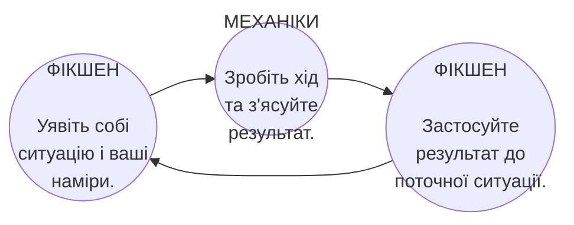

# МЕХАНІКА ТА ФІКШЕН

*Ironsworn* — це гра. Як така, вона використовує різноманітні **механіки (mechanics)** для вирішення ситуацій та викликів. Ви робите ходи і кидаєте граники. Ваш персонаж використовує характеристики, шкали та активи як відображення власних здібностей та готовності. Результат ходу може мати механічний вплив, такий як збільшення шкали імпульсу (momentum) або зменшення шкали здоров'я (health). Керування своїми ресурсами та прийняття рішень, що базуються на бажаному механічному результаті, є частиною викликів і веселощів гри.

**Фікшен (fiction) / світ гри** допомагає вам визначати та розуміти ваш сеттинг і вашого персонажа. Він керує минулим, особистістю та мотиваціями персонажа. Фікшен забезпечує рамки для ситуацій, з якими ви стикаєтеся, світу, в якому ви живете, а також людей або істот, яких ви зустрічаєте. Граючи, ви виконуєте дії крізь уявну перспективу вашого персонажа. Світ гри допомагає зрозуміти, що станеться далі.

> Перетин фікшену та механік — це те, що робить рольовий досвід яскравим і захопливим. Уявіть, що механіки — це голка, а фікшен — це ваша нитка. Використовуючи їх разом, ви сплетете килим своєї історії в *Ironsworn*.

## СЛІДУЙТЕ ЗА ФІКШЕНОМ І КЕРУЙТЕ НИМ

Без історії гра — це просто вправа в киданні граників. Без механік ваша історія позбавлена виборів, наслідків і сюрпризів. Ідеальна сесія *Ironsworn* використовує як механіки, так і світ гри, але веде і слідує за фікшеном (leads and follows with the fiction).

Що це означає? Вважайте фікшен обкладинками вашої книги з ходами. Ви починаєте з уявлення ситуації. Що відбувається? Що ви намагаєтеся зробити? Як ви це робите? Що вам протистоїть? З якими ускладненнями ви можете зіткнутися? Якщо ви граєте соло — уявіть це. Якщо в кооперативі — обговоріть. Якщо ви ведучий — окресліть сцену для гравців і разом з ними з'ясуйте всі деталі.

Чи запускає фікшен хід? Якщо так, зробіть його. Киньте граники. Інтерпретуйте механічний результат у контексті поточної ситуації. Якщо одна з ваших шкал статусу — здоров'я, дух (spirit), припаси (supply) чи імпульс — змінюється в результаті ходу, уявіть, як це виглядає у світі гри. Не просто пересувайте числа. Опишіть, як це позначається на стані і готовності персонажа. Потім перенесіть результати вашого ходу назад у фікшен. Як змінюється ситуація? Що відбувається далі?

### ЗНАЙТИ БАЛАНС

Рівень уваги, яку ви приділяєте фікшену, змінюється залежно від ситуації та бажаного темпу гри. Ви можете відігрувати цілі сцени — наприклад, взаємодію з вашими союзниками та іншими персонажами — винятково через фікшен, не користуючись ходами. В інший час ви можете швидко пропустити опис деталей, щоб швидше рухатися далі. Це нормально. Використовуйте механіку ходів, щоб зобразити природну драму і невизначеність намірів та перешкод, але завжди шукайте можливості додати текстури і барв вашому світу за допомогою ігрового світу.

> Ви уявляєте швидку сцену: ви повертаєтесь додому та збираєте своє спорядження. Тут не запускається жоден з ходів. Ви пакуєте припаси і вдягаєте броню. Кольчуга здається важчою, ніж ви пам'ятаєте, наче обтяжена похмурими спогадами.
> 
> Ви зупиняєтесь на мить у дверях. Ваша рука лежить на руків'ї меча. "Меч, що не знав крові, — це марнування заліза," — казала вам колись мати. Ви згадуєте її слова зараз і швидко молитеся, щоб ваш меч залишився в піхвах. Він і так побачив достатньо крові.
> 
> Часу обмаль. Треба починати квест.

## ФРЕЙМІНГ ФІКШЕНУ

*Ironsworn* не акцентує увагу на деталізованих ситуативних механіках. Натомість більшість деталей абстрагується через ваші ходи, і вони покладаються на **фреймінг фікшену (fictional framing)**.

Уявіть це як переміщення фігури на шахівниці. Це пішак чи королева? На якій вона клітинці? Які ще фігури на дошці? В якому стані знаходиться гра? Всі ці деталі впливають на ваш рух і те, що станеться далі. Тут є правила. Ви не можете просто вирішити посунути пішака на три клітинки чи скинути ворожі фігури з дошки.

Ігровий процес в *Ironsworn* набагато менш обмежений, ніж у шахах, але все ж формується правилами вашої наративної реальності. Ваші дії та події в історії повинні мати зміст для персонажів, сеттингу та фікшену, який ви створили під час гри. Минуле вашого персонажа, його навички, переконання, цілі та спорядження впливають на те, які дії ви можете виконувати і як ви ці дії уявляєте — навіть коли ці елементи не закріплені характеристикою (stat) або активом. НПС не мають детальних механічних атрибутів, але зображуються відповідно до їхнього опису й намірів, які ви встановили через гру.

Фреймінг фікшену — це ваша дороговказна зоря. Це допомагає створити персонажа, світ та ситуації, які виглядають автентично та мають відповідні наслідки.

Як фреймінг фікшену впливає на гру?

* **Це додає текстури до вашої історії.** Деталізація збагачує ваш наратив, створює можливості для нових викликів і квестів, і допомагає вам візуалізувати свого персонажа і свій світ.
* **Він визначає ходи, які ви не можете зробити.** Якщо у вас немає належного спорядження або позиції, щоб зробити хід, ви не можете його зробити. Без дуже вагомих аргументів ви не зможете *Примушувати (Compel)* заклятого ворога вам допомогти.
* **Він визначає ходи, які ви повинні зробити (або яких можете уникнути).** Якщо ви беззбройні і хочете *Напасти (Strike)* на ворога, що тримає спис, вам слід здійснити *Стріти небезпеку (Face Danger)* або *Здобути перевагу (Secure an Advantage)*, щоб підібратися ближче. Якщо вам потрібна інформація від когось, з ким у вас є довіра та співпраця, вам не знадобиться використовувати *Примушувати* для того, щоб зробити *Зібрати інформацію (Gather Information)*.
* **Він спрямовує результати ваших ходів.** Звертайтеся до фікшену, коли маєте питання щодо наслідків ходу, особливо коли потрібно *Сплатити ціну (Pay the Price)*. Ви отримуєте механічний ефект, як-от шкоду? Чи стикаєтесь із новим наративним ускладненням? Якщо сумніваєтесь, *Спитайте Оракула* і застосуйте контекст вашого фреймінгу фікшену, щоб розтлумачити відповідь.
* **Він допомагає визначити ранг ваших викликів.** Ранг, який ви призначаєте для своїх квестів, подорожей або поєдинків, базується на масштабах виклику в межах фікшену.

Наприклад, уявіть, що ви потрапили у снігову бурю під час подорожі. Зима в Залізних Землях може бути жорстокою. Як цей шторм і готовність вашого персонажа впливають на історію? Встановлення фактів через фікшен, будь то як результат ходу чи просто розкриття наративної деталі, допомагає сформувати рамки викликів, з якими ви стикаєтеся.

| | |
| :--- | :--- |
| **Наративна текстура вашої історії.** | Якщо ви зіткнулися у своїх мандрах із зимовим штормом, сліпучий сніг та холодний вітер додають промовистих деталей вашій подорожі. |
| **Ходи, які ви не можете зробити.** | Якщо вас вигнали зі спільноти, ви не можете здійснити *Співіснування (Sojourn)* там, щоб знайти прихисток від шторму. |
| **Ходи, які ви повинні зробити (чи уникнути).** | Якщо ви опинилися в центрі шторму без важкого плаща та хутра, вам доведеться *Стріти небезпеку*, щоб витримати жорстокий холод. |
| **Результати ваших ходів.** | Якщо ви отримуєте промах під час ходу *Стріти небезпеку*, щоб вистояти перед бурею, ви, швидше за все, отримаєте шкоду, стрес або втрату припасів. Або ж, можливо, ви зустрінете ще страшнішу загрозу, ніж цей шторм. |
| **Ранг ваших викликів.** | Морок (Frostbound) виринає із сліпучого снігу. Його мертві очі горять холодним світлом. Ви стискаєте свій меч руками, що тремтять і задубіли від холоду, і робите хід *Увірватись в бій (Enter the Fray)*. Ви вирішуєте, що морок набуває містичної сили завдяки шторму, тому піднімаєте його ранг на один рівень. Це робить його екстремальним ворогом. |

У кооперативних режимах чи з ведучим ви разом розбудовуєте спільне бачення поточної ситуації. Якщо щось незрозуміло або існують розбіжності між поглядами гравців, зачекайте хвилинку й обговоріть це, щоб усі чітко уявили сцену. У сольній грі ви самі керуєте цією наративною реальністю. У будь-якому разі, знаходьте можливості збільшити ставки та представити драматичні нови виклики й конфлікти. Грайте з фікшеном, але не руйнуйте його. Випробовуйте своїх персонажів. Ламайте стереотипи.

> Ви мусите вирушити на пошуки торгового каравану, але мандрівка пішки не має сенсу в рамках вашого фікшену. Вони випереджають вас на день. Щоб їх наздогнати, потрібен кінь.
> 
> Характеристики коня не визначені правилами *Ironsworn*. Нас не цікавить його ціна, швидкість бігу, або як багато він їсть. Актив **Кінь (Horse)** як супутник дав би Саскії механічний бонус у певних ситуаціях, але до набору вашого персонажа він не входить.
> 
> Роль коня, отже, полягає в тому, щоб додати деталізації у вашій подорожі й вплинути на ходи, які ви можете використати, а також на їх наслідки. Для моменту, пересування верхи задає фікшен, необхідний для того, щоб *Вирушити в подорож* навздогін каравану.
> 
> Чи має Саскія коня для верхової їзди? Ви вирішуєте *Спитати Оракула (Ask the Oracle)*, задаючи йому ймовірність 50/50.
> 
> "Ні," — каже Оракул. То що робити далі?
> 
> Було б обґрунтовано припустити, що дружина наглядачки позичить вам свого коня. Це доповнення до розповіді ідеально підходить до створеного фікшену. Ви намагаєтеся допомогти наглядачці — вашій подрузі. Ви дали щодо цього залізну присягу. Відзичити коня у її дружини не виглядає як ситуація з високими ризиком або невизначеністю, а тому застосовувати сюди *Примушувати (Compel)* не має сенсу.
> 
> Ви уявляєте цього коня, точніше одну з кобил наглядачки. Булана масть, але грива чорна як ніч. Ви даєте їй ім'я — Наката — і записуєте його на аркуші.
> 
> Щоб додати ще кілька штрихів для характеру тварини, ви звертаєтеся до таблиці "Опис Персонажа/Істоти", і Оракул відповідає: "Обережна" (Wary). Ви теж фіксуєте це. Цей кінь буде боязливим. У скрутний момент вам доведеться застосувати хід *Стріти небезпеку (Face Danger)*, аби впоратися з ним. Крім того, кінь може поранитися або навіть загинути через ваш провал в одному з ходів.
> 
> А наразі у вас є кінь. Час вирушати.

## ПРЕДСТАВЛЕННЯ СКЛАДНОСТІ

Можливо, ви знайомі з рольовими іграми, в яких кожному завданню призначається рівень складності або модифікатор. Гнучкість, що дозволяє робити кожен кидок граників контекстно-залежним — визначати шанси на успіх відповідно до умов — підтримує досвід, який імітує ваш вигаданий світ.

Однак правила *Ironsworn* не використовують дрібну механіку для конкретних викликів або можливостей, які може застосувати ваш ворог. Труднощі подолання викликів відображені здебільшого через ваш фреймінг фікшену.

### З СЕРЦЯ ПЕКЛА Я ДАЮ ТОБІ БІЙ

Левіафан (leviathan) — це стародавнє морське чудовисько ([сторінка 154](5-Foes-and-Encounters_5-Beasts.md#левіафан)). Його дуже важко вбити через його епічний ранг, і воно завдає епічної шкоди, проте не має інших механічних властивостей. Звернувшись до опису Левіафана, ми побачимо "шкіру з заліза". Але кидок *Напасти (Strike)* проти Левіафана виглядає так само, як проти рядового бандита. У будь-якому разі вам слід кинути кубик дії (action die), додати характеристики (stats) і бонус, і порівняти їх із кидком виклику. Шанси на успіх чи провал будуть однаковими.

То як же тоді дати Левіафанові належне — статус жахливого і невразливого супротивника? Відповідь полягає у вашому фікшені.

Якщо ви дали присягу здолати Левіафана, чи є у вас достатньо міцна зброя? Удар голими руками навряд чи спрацює. Навіть смертельна зброя, така як спис, ледве приверне його увагу. Можливо, ви вирушили на пошуки Безоднього Гарпуна, старовинного артефакту зі Старого Світу, викутого з кісток мертвого морського бога. Ця легендарна зброя дає вам потрібний фреймінг фікшену для подолання монстра, а його придбання може стати важливою проміжною віхою у виконанні присяги знищити це чудовисько.

Навіть зі зброєю напоготові, чи зможете ви вгамувати свій страх, стоячи на носі човна, поки вода шумить навколо, а розкрита паща монстра знаходиться одразу під поверхнею? Пройдіть випробування *Стріти небезпеку (Face Danger)* з Серцем, щоб дізнатися.

Наслідки ходу повинні враховувати жахливу міць Левіафана. Ви отримали промах? Чудовисько розбиває ваш човен на друзки і намагається затягти вас на глибину. Якщо ви спробуєте виконати хід *Стріти небезпеку*, відпливши подалі, варто пам'ятати, що обігнати Левіафана у воді неможливо. Тож вам доведеться шукати інший вихід.

Пам'ятайте ідею фреймінгу. Ваша готовність і суть виклику визначають необхідність долати більшу небезпеку і виконувати більше дій. Одразу ж після кидка, ваш фікшен створює ідеальний контекст для його наслідків.

### НАЛАШТУВАННЯ РАНГІВ ВИКЛИКУ

Коли ви виконуєте ходи *Вирушити в подорож (Undertake a Journey)*, *Увірватись в бій (Enter the Fray)* або *Дати залізну присягу (Swear an Iron Vow)*, подумайте про фреймінг фікшену при призначенні рангу виклику. Наприклад:

* Ваша мандрівка в пошуках Левіафана проходить жорстокими морями і серед оточених туманами скель? Можливо, варто підняти ранг, коли ви виконуєте хід *Вирушити в подорож*.
* Ви уклали угоду з наглядачем місцевого клану і заручилися його флотом? Вступаючи в битву разом зі своїми НПС-союзниками через хід *Увірватись в бій*, цілком логічно понизити ранг Левіафану на рівень чи два. Подібний союз також може вважатися за крок *Досягти проміжної віхи (Reach a Milestone)*.

Ранг відображає ваш бажаний темп гри. Налаштуйте фікшен і призначте ранг згідно з тим, як сильно ви хочете сфокусуватися на даному виклику всередині вашої історії. Крім того, не будьте надто лагідними до вашого персонажа: перемога чи поразка в безнадійних ситуаціях роблять ваші історії визначними. Будьте епічними! Або загиньте у славній спробі.

## НАБЛИЖЕННЯ І ВІДДАЛЕННЯ

У ролі сценариста, режисера й редактора (або перебуваючи у співпраці з іншими гравцями), ви контролюєте фокусування сцени у створеному вами фікшені.

Уявіть себе в безнадійній битві: ваш супротивник — велетень-первородок, який орудує жахливою сокирою. Цей велетень відкинутий власним кланом і ворогує з Залізоземцями. Він дев'яти футів на зріст. Чорт забирай, від самого його вигляду у вас кров холоне в жилах.

Ви ж боретеся зі списом і щитом: ховаєтесь від сильного розмаху сокири, задіюючи *Стріти небезпеку (Face Danger)*. Точне влучання (strong hit). Ви отримуєте ініціативу (initiative). Наступним кроком ви намагаєтесь *Напасти (Strike)*, б'єте списом і отримуєте "ледь влучаєте". Вдаряєте велетня в ногу; це 2 шкоди — ви відмічаєте прогрес на шкалі. Однак, цього разу ініціатива за вашим ворогом.

Що ж буде далі?

Час завмирає. Уява малює перед вами сцену. Ранковий туман над землею. Сонце стоїть ще низько, тому відкидає довгі тіні. Краплинки крові висять у повітрі. На вашому обличчі сумніви перемежовуються з рішучістю: ваш погляд спрямований на спис, який щойно встромився просто у велику ногу ворога. Ваша жертва реагує на вдалий хід, голова відкинута назад, щелепи зімкнуті. А його важка сокира високо піднята вгору.

Цей момент наповнений драмою; зупиніться на мить і подумайте. Як велетень зреагує? Скине сокиру та вдарить щодуху? Різко б'є ногою? Або спробує схопити ваш спис і просто зламати його навпіл? Зверніться до фікшену. Якщо сумніваєтесь і бажаєте здатися на милість долі — *Спитайте Оракула*.

А час не стоїть на місці: смертоносний двобій продовжується. Ворог кидається, а ви реагуєте. Киньте граники, зчитайте результати. Не варто забувати: спершу фікшен, потім хід, а вже потім наслідки ходу повертаються до фікшену. Якщо це цікаво, якщо це підживлює загальну атмосферу бою, продовжуйте.

У бою кожна секунда на рахунку, втім саме ви відмічаєте цей час. Хід *Напасти* може обернутися вирішальним махом, що обірве чиєсь життя чи скруту. А можливо на це знадобиться серія неминучих блоків, випадів та ударів. Ви не обмежені певними раундами й часовими періодами — вигадуйте. Щобільше, у грі є цікавий хід бою, *Поєдинок (Battle)* ([сторінка 86](3-Moves_4-Combat-Moves.md#поєдинок)), який абстрагує всю сутичку в єдиний кидок.

Згодом, розібравшись із велетнем гігантських розмірів, ви продовжуєте свою місію: шлях веде в гори. Але з кидком у ході *Вирушити в подорож* випадає "ледь влучаєте" (weak hit). Уявіть це як монтажну склейку: ви обережно пересуваєтеся з лісу в пагористу пустку. Лише раз стаєте на ночівлю біля бурхливої річки. Звужуючи очі, ви дивитеся в сторону небезпечного шляху...

Час стискається. Тим часом цілий день промайнув: якби кидок обернувся промахом, то все пішло б не за планом. Згодом поверніться у фокус і з'ясуйте, що саме пішло не так.

У цьому полягає ігровий потік: час тече за вашим бажанням. Ходи лише допомагають зобразити і обміряти його. Ви вільно можете абстрагувати те, що здається вам не дуже цікавим, або зосередити вплив на історію.

> Рушаючи в путь, перед вашими очима малюється весняний ранок вашого поселення, і ви нишком молите всіх богів застерегти наглядачку від передчасної смерті.
> 
> У ході *Вирушити в подорож (Undertake a Journey)* ви кидаєте граники, встановивши рівень небезпечний, й отримуєте точне влучання. Ви відмічаєте прогрес і вибираєте варіант збереження власних припасів. Далі, ви трохи віддаляєте камеру, щоб уявити, як пройшов ваш перший подорожній день. Ви йдете торговим шляхом (що є звичайнісінькою стежкою між двох пагорбів) на південь. Погода хороша. На вечерю ви піймали товстого зайця.
> 
> Що за орієнтир буде вашим першим? Ви вирішили *Спитати Оракула*, і таблиці Регіон і Опис Локації ([сторінка 177](6-Oracles_2-Ironland-Oracles.md#оракул-6-опис-локації)) відповідають: "Містичне місце" та "Красиве". Як ви це сприймаєте?
> 
> Можливо, це група високих стоячих каменів, які місцеві називають "Три Діви". Ви прагнете більших деталей і кидаєте на таблицях Дія і Тема: Оракул видає "Спілкування через сни".
> 
> Вночі ви бачите вродливих жінок, які примарно літають навколо і спілкуються незрозумілою для вас мовою. Цікаво, вони віщують щось хороше, чи несуть прокляття? Ви швидко занотовуєте цей цікавий момент. Звідси може з'явитися і новий поворот у сюжеті.
> 
> Ви також змогли кинути на хід *Вирушити в подорож* ще тричі, заробивши точні влучання і зафарбувавши комірки. Ваша подорож видається досить звичайною і дещо абстрактною. Аж раптом ви кидаєте на хід *Розмістити табір (Make Camp)* і отримуєте "ледь влучаєте". Що ж, відпочинок не вийшов: вам постійно снилися відлуння жахливих подій, і ви застосовуєте *Зазнати стресу (Endure Stress)*.
> 
> Доля приберегла для вас кілька сюрпризів. Значення ходу — "вас наздогнав випадок", ще й з дублем: тепер ви можете вкинути неймовірний сюжетний поворот.
> 
> Настав час сфокусувати камеру...
