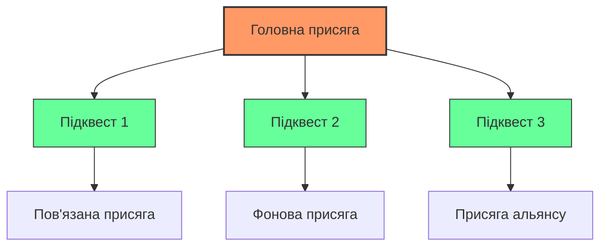
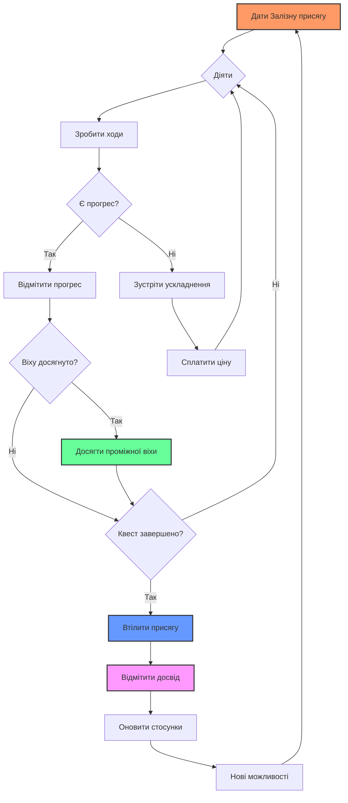

# КЕРУВАННЯ ВАШИМИ ПРИСЯГАМИ

## ДОСЯГНЕННЯ ПРОМІЖНИХ ВІХ

У міру того, як ви працюєте над втіленням своїх присяг, ви досягатимете важливих проміжних віх. Вони представляють значні прориви у вашому квесті.

### Що вважається Проміжною віхою?
Проміжна віха — це **значне досягнення**, яке суттєво наближає вас до вашої мети. Приклади включають:

- **Відкриття**: Знаходження місцезнаходження стародавнього артефакту.
- **Альянс**: Заручення підтримкою могутнього союзника.
- **Подолання**: Перемога над серйозною перешкодою або ворогом.
- **Прозріння**: Здобуття критичної інформації, яка змінює ваш підхід.
- **Прогрес**: Завершення значної частини вашої подорожі.

### Відмітка Проміжних віх
Коли ви **Досягаєте проміжної віхи**:
1. **Відмітьте 2 клітини** на шкалі прогресу вашої присяги.
2. **Скиньте свій імпульс** до +0 (якщо він був негативним).
3. **Зробіть паузу**, щоб визнати своє досягнення.

> **🎯 Порада щодо віх**: Не відмічайте проміжні віхи за дрібні досягнення. Збережіть їх для по-справжньому значущих моментів, які відчуваються як прориви у вашій історії.

### Частота Проміжних віх
- **Клопітні присяги**: 1-2 віхи
- **Небезпечні присяги**: 2-3 віхи  
- **Грізні присяги**: 3-4 віхи
- **Екстремальні/Епічні присяги**: 4+ віхи

```
╔══════════════════════════════════════════════════════════════╗
║                    ШКАЛА ПРОМІЖНИХ ВІХ КВЕСТУ                ║
╠══════════════════════════════════════════════════════════════╣
║  [ ] [ ] [ ] [ ] [ ] [ ] [ ] [ ] [ ] [ ] [ ] [ ]           ║
║  ▲   ▲   ▲   ▲   ▲   ▲   ▲   ▲   ▲   ▲   ▲   ▲              ║
║  │   │   │   │   │   │   │   │   │   │   │   │              ║
║ Початок          Віха 1         Віха 2        Завершення    ║
╚══════════════════════════════════════════════════════════════╝
```

## БРАТИСЯ ЗА НОВІ КВЕСТИ

У міру просування у ваших пригодах ви відкриватимете нові виклики та можливості, які призведуть до нових присяг.

### Коли починати нові квести
Розгляньте можливість дати нову присягу, коли:
- **Поточний квест виявляє** більшу проблему.
- **З'являються нові загрози**, які потребують уваги.
- **З'являються можливості**, які збігаються з цілями вашого персонажа.
- **Союзники просять допомоги** з їхніми власними квестами.
- **Історія природним чином розгалужується** у нових напрямках.

### Керування кількома присягами
У вас може бути **кілька активних присяг**, але зважайте на таке:

- **Фокус**: Не розпорошуйте свої сили занадто сильно.
- **Пріоритет**: Які присяги є найбільш нагальними або важливими?
- **Зв'язок**: Як ваші квести пов'язані між собою?
- **Ресурси**: Чи є у вас імпульс та активи для досягнення кількох цілей?

### Типи присяг та їх зв'язки


## ВТІЛЕННЯ ВАШОЇ ПРИСЯГИ

Коли ви заповнили шкалу прогресу для присяги, настав час **Втілити присягу** і довести свій квест до завершення.

### Хід Втілення
Коли ви **Втілюєте присягу**, киньте +ранг виклику присяги:

| Результат кидка | Наслідок |
|-----------------|----------|
| **Точне влучання** | Ви виконуєте свою присягу та досягаєте мети. Відмітьте досвід і виберіть одне: +1 імпульс або відмітьте 2 клітини на шкалі стосунків. |
| **Ледь влучаєте** | Ви виконуєте свою присягу, але з ускладненням. Відмітьте досвід і виберіть одне: -1 імпульс або зазнайте -1 припаси. |
| **Промах** | Ви не виконали свою присягу. Ви можете спробувати ще раз, але спочатку ви повинні **Сплатити ціну**. |

### Святкування успіху
Коли ви втілюєте присягу:
- **Відмітьте досвід** для зростання вашого персонажа.
- **Оновіть ваші стосунки** — деякі з них можуть зміцніти, інші можуть змінитися.
- **Подумайте про вплив** на вашого персонажа та світ.
- **Дивіться вперед** на нові виклики та можливості.

### Коли присяги йдуть не за планом
Якщо ви не змогли втілити присягу:
- **Зробіть висновки з цього досвіду** — що пішло не так?
- **Подумайте про наслідки** — як ця невдача вплинула на вас?
- **Вирішіть, чи варто спробувати ще раз**, чи покинути цей квест.
- **Дайте нову присягу**, щоб вирішити ситуацію, якщо це необхідно.

## СКРІПЛЕННЯ НОВИХ СТОСУНКІВ

Ваші пригоди зводитимуть вас з новими людьми, місцями та ідеалами. Ці зв'язки стають стосунками, які посилюють вашого персонажа та відкривають нові можливості для історії.

### Типи нових стосунків
- **Люди**: Союзники, наставники, суперники або вороги, яких ви зустрічаєте.
- **Місця**: Локації, які стають важливими для вашої історії.
- **Ідеали**: Нові переконання чи цілі, які вас надихають.

### Коли скріплювати стосунки
Розгляньте можливість скріпити нові стосунки, коли:
- **Хтось значно допоміг вам**.
- **Ви проводите багато часу** в певній локації.
- **Ви приймаєте нове переконання** чи мету.
- **Відносини еволюціонують** від випадкових до значущих.
- **Історія вимагає** постійного зв'язку.

### Відмітка нових стосунків
Коли ви скріплюєте нові стосунки:
1. **Запишіть це** на аркуші персонажа.
2. **Подумайте про їх природу** — позитивні, негативні чи складні.
3. **Подумайте про їхній потенціал** для майбутніх історій.
4. **Відмітьте прогрес**, якщо це відповідає розвитку відносин.

## РОЗВИТОК ВАШОГО ПЕРСОНАЖА

Долаючи виклики та завершуючи квести, ваш персонаж зростає у досвіді та можливостях.

### Отримання досвіду
Ви відмічаєте досвід, коли:
- **Втілюєте присягу** (будь-який результат).
- **Досягаєте проміжної віхи** у квесті.
- **Стрічаєте смерть** і виживаєте.
- **Зазнаєте значних труднощів** і не здаєтеся.

### Використання досвіду
Коли у вас є 3 відмітки досвіду:
1. **Очистіть усі відмітки досвіду**.
2. **Виберіть одне вдосконалення (загартування)**:
   - Підвищіть одну характеристику на +1.
   - Додайте новий актив.
   - Покращіть існуючий актив.
   - Вивчіть нову здібність.

### Арки розвитку персонажа
Подумайте про розвиток вашого персонажа:
- **Навички**: Які нові здібності він здобув?
- **Знання**: Що він дізнався про світ?
- **Відносини**: Як еволюціонували його стосунки?
- **Ідентичність**: Як він змінився як особистість?

## БЛОК-СХЕМА ПРОХОДЖЕННЯ КВЕСТУ



## ПОРАДИ ЩОДО КЕРУВАННЯ КВЕСТАМИ

### Будьте організованими
- **Слідкуйте за кількома присягами** за допомогою чітких нотаток.
- **Оновлюйте прогрес** після кожної значущої дії.
- **Регулярно переглядайте стосунки**, щоб підтримувати їхню актуальність.

### Підтримуйте Імпульс
- **Фокусуйтеся на одному або двох головних квестах** одночасно.
- **Використовуйте проміжні віхи**, щоб підтримувати динаміку між сесіями.
- **Балансуйте виклики та досягнення** для підтримання зацікавленості.

### Насолоджуйтесь Подорожжю
- **Дозволяйте квестам еволюціонувати** природним чином з історії.
- **Не примушуйте себе завершувати їх**, якщо історія веде в іншому напрямку.
- **Цінуйте досвід** так само, як і місце призначення.

---

*"Кожна дана присяга — це історія, яка чекає, щоб її розповіли. Кожна досягнута віха — це заслужена перемога. Кожні скріплені стосунки — це зв'язок, який триває довше, ніж сам квест."*