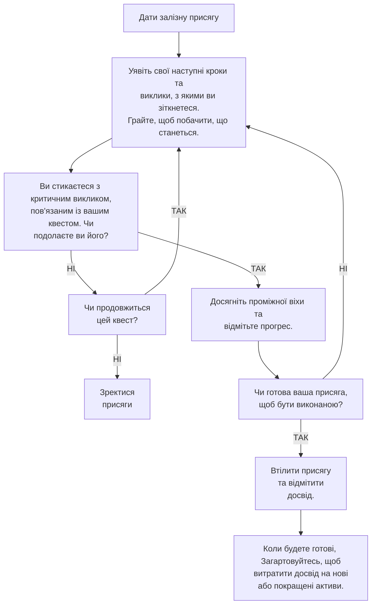

# КЕРУВАННЯ ВАШИМИ КВЕСТАМИ

Квести за присягою — це наративний двигун ваших пригод в *Ironsworn*. Коли ви починаєте свою кампанію, ваш персонаж має дві присяги: вашу фонову присягу ([сторінка 195](7-Gameplay_1-Starting-Your-Campaign.md#відмітьте-фонові-стосунки)) та присягу, спричинену спонукальним інцидентом ([сторінка 196](7-Gameplay_1-Starting-Your-Campaign.md#уявіть-спонукальний-інцидент)).

Просування в цих квестах вимагає від вас зустрічатися з перешкодами та долати їх. Ви будете вирушати в небезпечні подорожі, розкривати інформацію, здобувати підтримку НПС, знаходити важливі предмети та перемагати могутніх ворогів. Ваш персонаж буде намагатися подолати власні обмеження, а його упередження та відданість будуть піддаватися випробуванням.

Розміщення цих перешкод на вашому шляху слугує не лише для драматичних цілей. Успіх у цих випробуваннях, пошук шляху вперед дозволяє вам досягати проміжних віх і відмічати прогрес у ваших квестах.

> У фікшені залізна присяга — це значуща, глибока обіцянка. Якщо ситуація не є драматичною та не має відношення до цілей і принципів вашого персонажа, вона, ймовірно, не варта присяги. Це може бути проміжна віха для квесту або просто наративна диверсія як можливість для відігравання ролі чи розбудови світу.
> 
> Якщо ви хочете взятися за квест Залізоземця, але проблема перед вами не здається достатньо значущою, підсильте її. Надайте їй контекст. Підніміть ставки.

## ДОСЯГНЕННЯ ПРОМІЖНИХ ВІХ

**Уявіть свій квест в *Ironsworn* як шлях із каміння, що веде через воду.** Кожен камінь позначає великий крок вперед — проміжну віху — що активує хід *Досягти проміжної віхи*.

Ви можете спланувати деякі з проміжних віх вашого квесту заздалегідь ([сторінка 200](7-Gameplay_1-Starting-Your-Campaign.md#створення-плану-присяги)). Інші з'являтимуться природним чином із фікшену. Результат ваших ходів або творчі підказки можуть спрямувати ваш квест у несподіваних напрямках, призводячи до нових проміжних віх і, можливо, навіть до нових присяг.

### ЩО ГІДНЕ ПРОМІЖНОЇ ВІХИ?

Текст ходу *Досягти проміжної віхи* стверджує:

> Коли **ви робите значний прогрес у вашому квесті**, долаючи критичну перешкоду, завершуючи небезпечну подорож, розгадуючи складну таємницю, перемагаючи могутню загрозу, здобуваючи важливу підтримку або отримуючи ключовий предмет, ви можете відмітити прогрес.

Темп вашого квесту значною мірою визначатиметься тим, що ви вирішите вважати «значним прогресом». Проміжна віха повинна виконувати дві речі:

* **Вона має безпосередньо стосуватися вашого квесту.** Проміжна віха має бути значущою для вашого персонажа та вашої присяги. Непов'язаний виклик, з яким ви стикаєтеся під час виконання квесту, ймовірно, не є проміжною віхою.
* **Вона має представляти поворотний момент або великий крок вперед у вашому квесті.** Досягнення проміжної віхи вимагає зусиль і жертв від вашого персонажа. Незначне відкриття або легкий успіх, швидше за все, не є проміжною віхою, особливо для квесту вищого рангу. Не кожен крок, який ви робите, є проміжною віхою.

### ВІДМІЧАННЯ ПРОГРЕСУ

Ваші присяги використовують стандартну шкалу прогресу ([сторінка 14](1-Basics_5-Progress-Tracks.md#шкали-прогресу)), щоб виміряти, як далеко ви просунулися у своєму квесті. Ця шкала прогресу є механічним представленням ймовірності успіху, коли ви робите хід *[Втілити присягу](3-Moves_6-Quest-Moves.md#втілити-присягу)*. Більше заповнених клітинок означає кращі шанси на влучання в цьому ході. Шкала прогресу також показує, наскільки ви реалізували сюжетний потенціал у своєму квесті. Присяги вищих рангів вимагають більше фокусу у вашій історії та більше зусиль і жертв від вашого персонажа.

Коли ви *[Досягаєте проміжної віхи](3-Moves_6-Quest-Moves.md#досягти-проміжної-віхи)*, відмітьте прогрес відповідно до рангу вашої присяги.

* **Клопітний квест:** відмітьте 3 прогресу.
* **Небезпечний квест:** відмітьте 2 прогресу.
* **Грізний квест:** відмітьте 1 прогрес.
* **Екстремальний квест:** відмітьте 2 позначки.
* **Епічний квест:** відмітьте 1 позначку.

> Ви отримали промах для Саскії в ході *Вирушити в подорож*, і результат ходу каже, що вам «перешкоджає небезпечна подія». Плюс, у вас випав дубль, що дає можливість ввести несподіване ускладнення або поворот.
> 
> Ви *Спитали Оракула* для підказки, кинувши за таблицями Дії та Теми ([сторінка 174](6-Oracles_2-Ironland-Oracles.md#оракул-1-дія)). Оракул відповідає: «Зректися присяги».
> 
> Ви обмірковуєте значення цієї відповіді. «Зректися» наводить на думку про когось, хто влаштовує засідку і вимагає вашої здачі. Але як щодо «присяги»? Зараз у вас є дві присяги: «Перемогти клан Червоного Місяця» та «Врятувати наглядачку». Що, якщо це можливість пов'язати їх разом як спосіб реалізувати випавший дубль?
> 
> Можливо, ви натрапляєте на нальотчиків клану Червоного Місяця, войовничих родичів з вашого минулого життя, і вони мають якесь відношення до змови проти наглядачки.
> 
> Ви встановлюєте сцену. Група нальотчиків виходить із лісу біля стежки, перегороджуючи вам шлях. У них напоготові списи та луки. Ви уявляєте, як Саскія помічає їхні характерні розфарбовані щити. У неї перехоплює дихання.
> 
> Але ви не зацікавлені в переговорах із цими нальотчиками. Ви злізаєте з коня. Ви йдете до них з піднятими руками. Ви *Здобуваєте перевагу*, прикидаючись покірною, щоб заспокоїти їх, і отримуєте точне влучання. Лучники послаблюють приціл.
> 
> Ви *Питаєте Оракула*: «Чи хтось із них упізнав мене?». Ви були донькою лідера клану і були добре відомі. Ви визначаєте шанси як «ймовірно».
> 
> «Ні», — відповідає оракул.
> 
> Добре. Це молоді нальотчики. Недосвідчені. Залишені тут для якоїсь буденної справи. Можливо, вони служать свого роду ар'єргардом, щоб стежити за тими, хто може піти за торговим караваном.
> 
> Вам спадає на думку ідея. Ви хочете сплести докупи ці, здавалося б, не пов'язані наративні нитки. У вас відмічено вісім прогресу в подорожі. Можливо, наздогнати торговий караван не обов'язково має бути вашою метою. Що, якщо відповіді, які вам потрібні, знаходяться прямо тут?
> 
> Ви робите хід *Досягти місця призначення* і отримуєте точне влучання. Ця небезпечна подорож закінчена. Ви *Досягаєте проміжної віхи* і відмічаєте прогрес.
> 
> Повертаючись до сцени, ви уявляєте, як Саскія наближається до нальотчиків, а потім миттєво вихоплює меч. Ви *Вриваєтесь у бій*...

## БРАТИСЯ ЗА НОВІ КВЕСТИ

У розпалі квесту ви стикатиметеся з ситуаціями, які дають можливості для додаткових присяг. Ці нові присяги можуть бути пов'язані з існуючими квестами або виникати з непов'язаних проблем.

### ДРУГОРЯДНІ КВЕСТИ

Під час виконання квесту ви можете дати обіцянку або працювати над подоланням перешкоди, яка варта власної присяги. Уявіть це як розрив на вашому шляху, через який перекинуто місток із проміжних віх. Цей коротший шлях — ваш другорядний квест. Ви *Дасте залізну присягу*, призначите їй ранг і відмічатимете прогрес, працюючи над виконанням цієї нової присяги.

Ви не будете відмічати прогрес у своєму основному квесті, поки не *Втілите присягу* у другорядному квесті. Коли два шляхи зійдуться, коли ваш другорядний квест буде завершено, ви зможете *Досягти проміжної віхи* в основному квесті і продовжити свій шлях.

Коли перешкода є власним квестом, а не просто проміжною віхою? Зверніться до фікшену. Чи є це значним, самостійним викликом? Чи значуще це для вашого персонажа? Чи створює це можливості для нової драми та конфлікту? Якщо так, це, ймовірно, варте присяги.

> Ви перемагаєте нальотчиків, але це важка перемога. Ви поранені, а ваш щит розбитий. На щастя, ви можете допитати одного з вцілілих нальотчиків. Ви відіграєте сцену, як ви *Збираєте інформацію*, щоб дізнатися, як клан Червоного Місяця причетний до хвороби наглядачки.
> 
> Через влучання в цьому ході та кілька запитань до оракула ви виявляєте, що нальотчики справді перебувають у центрі цієї проблеми. Асасин, що подорожує з торговим караваном, отруює лідерів поселень Залізоземців. Спричинений цим розбрат послабить ці села і зробить їх легкою здобиччю. З настанням зими нальотчики пройдуться цим регіоном, наче темна хвиля.
> 
> Ви також дізнаєтеся природу отрути. Її витягують із рідкісної рослини, що зустрічається лише в серці Глибоких Диких Земель. Схеми вашої матері стали складнішими відтоді, як ви востаннє билися на її боці.
> 
> Ці відкриття варті ще однієї проміжної віхи. Ви *Досягаєте проміжної віхи* і відмічаєте прогрес. Це дає вам загалом чотири прогресу у вашій небезпечній присязі.
> 
> Що далі? Ви оглядаєте свій план присяги і згадуєте наративну підказку: «Отримати допомогу від травника, який живе глибоко в Диколіссі». Пошуки відлюдкуватого травника — який, сподіваємось, зможе дати протиотруту — цілком підходять для історії.
> 
> Ви вирішуєте пропустити експедицію в Диколісся і відмовитися від ходу *Вирушити в подорож*. Ви просто розташуєте ліс неподалік для потреб вашого наративу. Ви знайомі з цією травницею, вирішуєте ви, бо вона час від часу відвідує ваше село для торгівлі.
> 
> Ви відіграєте сцену, коли прибуваєте до її занепалої хатини і намагаєтеся переконати її виготовити протиотруту. Ви уявляєте її дратівливою, ексцентричною жінкою, якій байдуже до вашого квесту. Ви намагаєтеся *Примусити* її. На жаль, ви отримуєте промах. Не бажаючи, щоб ваш наратив зайшов у глухий кут, ви вирішуєте, що вона — згідно з ходом — «поставить вимогу, яка дорого вам обійдеться». Зобов'язання взятися за другорядний квест звучить якраз доречно. Для повноти картини ви *Сплачуєте ціну* і втрачаєте -2 імпульсу, щоб відобразити згаяний час.
> 
> «Гніздо павуків-мучителів розповзається навколо», — каже вона. «Убий матку виводку і принеси мені її ікла. Вони мені все одно знадобляться для протиотрути».
> 
> Вона протягує вам залізну монету. «Присягнися або йди геть. Твій вибір».
> 
> Ви *Даєте залізну присягу*. Попереду робота...

### НЕПОВ'ЯЗАНІ КВЕСТИ

Ви можете стикатися з ситуаціями — не пов'язаними з вашими поточними присягами — які ваш персонаж змушений виправити. Це може статися органічно через фікшен, через підказки оракула або бути введеним вашим ведучим (GM) у грі з ведучим.

Якщо ви колись опинитеся без присяги, матимете труднощі з уявленням наступних кроків у поточному квесті або захочете дослідити новий наратив, нехай щось станеться. Введіть проблему. Ви можете використовувати початки пригод у цій книзі або *Спитати Оракула* й інтерпретувати відповідь.

Кілька ходів явно надають можливості взятися за нові квести як частину їхніх результатів. Наприклад, якщо ви перебуваєте на *Співіснуванні* і обираєте варіант взяти квест, ви можете ввести біду, з якою зіткнулася ця спільнота. Або, коли ви *Скріплюєте стосунки* чи *Примушуєте* і отримуєте ледь влучання, НПС висуває вам вимогу. Якщо це доречно для фікшену, ця вимога може вимагати складання присяги.

### ВІДКЛАДЕНІ КВЕСТИ

Квест може вимагати від вас отримати щось від НПС. Це може бути інформація, предмет або допомога іншого роду. Однак, як результат ходу або через фікшен, НПС може мати власні вимоги. Він може навіть хотіти, щоб ви *Дали залізну присягу* як вашу обіцянку виконати це.

Якщо ви зробите це, і НПС задовольниться самою обіцянкою (поки що), ви зможете продовжувати свій поточний квест. Ви розберетеся з цією новою присягою пізніше. Якщо допомога НПС є значним кроком вперед у вашому поточному квесті, вам слід *Досягти проміжної віхи*.

Майте на увазі, що складання залізної присяги — це священна обіцянка. НПС, особливо могутні, вимагатимуть її виконання. Ігнорування її означає, що ви *Зречетесь присяги*, що повинно мати драматичні наслідки у вашому наративі. Ви нажили ворога або зіпсували свою репутацію. Як інші сприйматимуть ваші присяги серйозно в майбутньому? Як ви самі?

### ПЕРЕТИН КВЕСТІВ

Якщо ви взялися за два пов'язані квести, ви можете зіткнутися з ситуацією, де проміжна віха дозволяє відмітити прогрес в обох присягах одночасно. Однак це має бути рідкісною подією. Два квести — це не стежки, що накладаються одна на одну, де кожен крок є проміжною віхою для обох. Замість цього уявляйте, що ці шляхи перетинаються в ключові моменти.

## ВТІЛЕННЯ ВАШОЇ ПРИСЯГИ

Фікшен, що рухає ваш квест, і механічний прогрес, представлений вашою шкалою прогресу, сходяться у вирішальний момент, коли ви вірите, що ваш квест закінчено. Саме тоді ви робите хід *Втілити присягу* ([сторінка 101](3-Moves_6-Quest-Moves.md#втілити-присягу)).

Керування вашим механічним прогресом і фікшеном для досягнення цього моменту вимагає певної майстерності. Це кінець третьої дії. Ваші актори мають бути на позиціях. Ваші декорації та реквізит мають бути на місці. Світло вмикається для фінальної сцени...

Шкали прогресу можуть допомогти вам задати темп. Якщо ваша шкала прогресу заповнюється набагато швидше, ніж ваша історія, уповільніть темп і зосередьтеся на ключових цілях та поворотних моментах як на проміжних віхах. Якщо ви відчуваєте, що ваша історія рухається до розв'язки набагато швидше за вашу шкалу прогресу, уявіть деякі ускладнення або повороти, які змінять ваш шлях і створять нові можливості для проміжних віх.

Однак майте на увазі, що не обов'язково заповнювати шкалу прогресу присяги до того, як ви *Втілите присягу*. Чи привів вас фікшен до моменту, коли ваш квест здається завершеним, але ваша шкала прогресу не заповнена навіть наполовину? Дійте. Ледь влучання або промах у ході *Втілити присягу* можуть створити цікаві історії та відкрити можливості для нових присяг.

> Граючи за Саскію, ви вбили павуків-мучителів за наказом травниці. Ви *Втілюєте присягу* для квесту «Убити матку виводку». Це також дозволяє вам *Досягти проміжної віхи* у вашому квесті «Врятувати наглядачку», поки травниця готує протиотруту.
> 
> Ви *Вирушаєте в подорож* назад до Попільного Дому. Оскільки це зворотна поїздка, і ви не хочете приділяти їй багато сюжетної уваги, ви встановлюєте її як просто клопітну. Вам заважає напружена зустріч із захисно налаштованим попелястим ведмедем та її ведмежам, але врешті-решт ви *Досягаєте місця призначення*. Ця фінальна подорож також слугує проміжною віхою у вашому квесті. Тепер у вас відмічено вісім клітинок на шкалі прогресу.
> 
> Ви уявляєте сцену, як поспішаєте до ліжка наглядачки. Вона бліда як смерть, її дихання настільки слабке, що його ледь можна вловити. Чи ви не запізнилися? Чи все це було даремно? Ви робите хід *Втілити присягу*, щоб дізнатися.
> 
> Ви кидаєте граники виклику. Це точне влучання. Ви уявляєте, як стан наглядачки повільно покращується. Колір повертається до її обличчя. Через деякий час вона прокидається.
> 
> Ваша присяга виконана. Ви отримуєте 2 досвіду за небезпечний квест і 1 бонусний досвід завдяки вашому активу **Вірний стягові**.

## СКРІПЛЕННЯ НОВИХ СТОСУНКІВ

Поки ви переслідуєте свої квести, стосунки, які ви формуєте, та труднощі, які ви долаєте разом з іншими персонажами, можуть отримати фікційне та механічне значення через хід *Скріпити стосунки* ([сторінка 74](3-Moves_3-Relationship-Moves.md#скріпити-стосунки)).

Нові стосунки можуть бути природним результатом успішного квесту. Коли ви успішно *Втілюєте присягу* на службу людині або спільноті, ви можете перекинути будь-які граники, якщо *Скріплюєте стосунки* з ними.

> Ви уявляєте, як дружина наглядачки відрізає косу зі свого волосся і дає її Саскії — знак вдячності та поваги. Ви стаєте на коліно і просите вибачення за те, що не маєте чого дати, окрім вашої подальшої служби Попільному Дому та наглядачці.
> 
> Ви робите хід *Скріпити стосунки* і отримуєте промах. На щастя, ваш успішний квест дозволяє вам перекинути будь-які граники. Ви кидаєте знову, отримуєте точне влучання і відмічаєте стосунки на своєму аркуші персонажа.

## РОЗВИТОК ВАШОГО ПЕРСОНАЖА

Коли ви успішно *Втілюєте присягу*, ви заробляєте очки досвіду. Цей досвід витрачається на придбання або покращення активів через хід *Загартовуватись* ([сторінка 103](3-Moves_7-Fate-Moves.md#загартовуватись)).

> Коли **ви фокусуєтесь на своїх навичках, отримуєте тренування, знаходите натхнення, отримуєте винагороду або знаходите супутника**, ви можете витратити 3 досвіду, щоб додати новий актив, або 2 досвіду, щоб покращити актив.

Ви можете витрачати свої очки досвіду, коли вони зароблені, або збирати їх для майбутнього використання. В обох випадках ви повинні звертатися до фікшену за контекстом та обґрунтуванням ваших нових здібностей. Ви можете спрямовувати свою історію до активу, який хотіли б придбати або покращити, або дозволити вибору активів природно випливати з цілей вашого персонажа та ситуацій, з якими ви стикаєтесь.

Активи можуть навіть слугувати фокусом нової присяги, даючи вам відчутну мету або винагороду за квест. Якщо ви *Дали залізну присягу* стати вправним **Майстром меча**, ви можете просуватися в цьому квесті, шукаючи тренувань, демонструючи свою майстерність та замовляючи виготовлення чудового клинка. Коли ви *Втілите присягу* і витратите досвід на актив **Майстер меча**, це буде задовільним і винагороджуючим завершенням вашого квесту.

Ще кілька прикладів пов'язання активів з вашою історією та присягами:

* Ви *Дали залізну присягу* охороняти торговий караван. Торговець обіцяє вам набір чудової броні в якості оплати. Коли ви *Втілите присягу*, ви візьмете свою нагороду і станете **Закутим у броню**.
* Ви знаходите покинуте село у своїх мандрах і виявляєте забутого, недоїдаючого **Хорта**. Ви виходжуєте його, і він стає вірним супутником.
* Щовечора в таборі ви тренуєтесь зі своїм союзником. Коли ви *Загартовуєтесь*, ви покращуєте свій актив **Застрільника**.
* Ви далеко подорожуєте у своєму квесті через глибокі ліси та високі пагорби і стаєте **Шляхошукачем**.
* Після того, як ви *Стрінете смерть*, ви повертаєтесь у світ і бачите **Крука**, що сидить на гілці над вами. Він дивиться на вас знаючим поглядом.
* Ви бачите, як жрець здійснює диво, і стаєте **Послушником**.
* Ви малюєте емблему вашої родини на своєму щиті, співаючи пісні ваших предків, і додаєте нову здатність **Щитоносця**.
* Ви перемагаєте могутнього воїна в ритуальному бою, і чутки про вашу майстерність як **Дуеліста** ширяться світом.
* Вам сняться повторювані сни про політ високо над Залізними Землями, де ви бачите світ гострими очима вашого яструба-супутника. Ці сни дають вам прозріння для покращення вашого ритуалу **Тотема**.
* Ви клянетесь повернути родинний меч вашої сім'ї у відомого нальотчика. Коли ви це робите, ви стаєте **Прив'язаним до клинка**.
* Ви були скалічені в бою, але вирішуєте вистояти як один із **Пошрамованих**.
* Ви були свідком смерті і приносили її іншим. Ви стояли на краю земель тіней і бачили, що лежить за ними. Це темне знання дозволяє вам проводити ритуал **Причастя**.
* Ви присягаєте на вірність амбіційній наглядачці і стаєте **Вірним стягові**.
* Ви клянетесь стати майстром містичних мистецтв і беретеся за квест, щоб тренуватися під керівництвом старшого містика. Коли ви завершуєте навчання, ви — **Ритуаліст**.

Уявлення того, як ваші нові здібності пов'язані з вашими присяжними квестами та досвідом, надає їм додаткового значення та контексту. Вони будуть нагадуванням про пройдені та непройдені шляхи, подолані виклики та сформовані стосунки.

> Ви заробили 3 досвіду у своєму квесті з порятунку наглядачки — достатньо, щоб купити новий актив. Ви *Загартовуєтесь* і купуєте супутника-**Коня**. Ви уявляєте, як наглядачка та її дружина дарують вам Накату, коня, який пройшов з вами через ваші небезпечні подорожі.
> 
> Наката добре вам служитиме. Ви хотіли б повернутися до свого простого життя фермера, але змову нальотчиків потрібно зупинити.
> 
> Настав час поглянути в очі своєму минулому.

## БЛОК-СХЕМА КВЕСТУ

