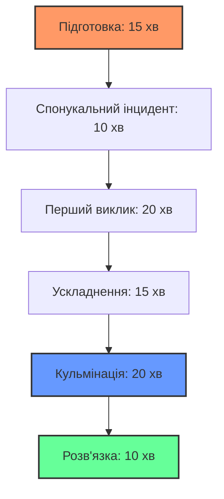
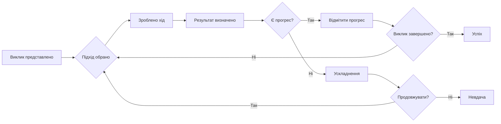

# ОПЦІЇ ГРИ

## КІЛЬКІСТЬ ГРАВЦІВ

Ironsworn гнучкий і може адаптуватися до різних розмірів групи, кожна з яких пропонує унікальний досвід.

### Соло гра
Гра в Ironsworn наодинці пропонує повний творчий контроль та особисту розповідь.

**Переваги:**
- **Повна свобода** — ви контролюєте кожен аспект історії.
- **Ваш власний темп** — грайте так швидко чи повільно, як бажаєте.
- **Глибоке занурення** — повний фокус на подорожі вашого персонажа.
- **Гнучкий розклад** — грайте, коли у вас є час.

**Виклики:**
- **Самомотивація** — ви повинні самостійно рухати історію вперед.
- **Об'єктивність** — балансування між викликом і успіхом.
- **Творчість** — генерація всього наративного контенту.
- **Підтримка імпульсу** — збереження захоплюючості історії.

**Поради для соло гри:**
- Часто використовуйте Оракул, щоб створювати несподіванки.
- Ведіть щоденник своїх пригод.
- Створюйте другорядних НПС для взаємодії.
- Встановіть регулярні ігрові сесії для підтримання стабільності.

### Кооперативна гра (2-3 гравці)
Гра в невеликій групі поєднує індивідуальну розповідь із елементами співпраці.

**Переваги:**
- **Спільна творчість** — спирайтеся на ідеї одне одного.
- **Взаємодія персонажів** — значущі стосунки між ігровими персонажами.
- **Взаємна підтримка** — допомагайте одне одному долати виклики.
- **Спільне створення світу** — будуйте Залізні Землі разом.

**Виклики:**
- **Координація** — узгодження графіків та стилів гри.
- **Баланс уваги** — забезпечення того, щоб кожен отримав свій час у центрі уваги.
- **Темп** — управління арками різних персонажів.
- **Вирішення конфліктів** — залагодження розбіжностей.

**Структура кооперативної гри:**
```
╔══════════════════════════════════════════════════════════════╗
║                   МОДЕЛЬ КООПЕРАТИВНОЇ ГРИ                   ║
╠══════════════════════════════════════════════════════════════╣
║  Гравець 1: Основний квест + Допоміжна роль                  ║
║  Гравець 2: Основний квест + Допоміжна роль                  ║
║  Гравець 3: Основний квест + Допоміжна роль                  ║
║  Спільне: Спільні квести + Події у світі                     ║
╚══════════════════════════════════════════════════════════════╝
```

### Гра з ведучим (3+ гравців)
Традиційна структура RPG з одним гравцем у ролі Ведучого (Game Master).

**Переваги:**
- **Чітка структура** — Ведучий надає напрямок та виклики.
- **Багатий світ** — Ведучий може розвивати глибоку історію та НПС.
- **Динамічні виклики** — Ведучий може адаптуватися до вибору гравців.
- **Спільний досвід** — спільна розповідь історії.

**Виклики:**
- **Підготовка Ведучого** — вимагає значного планування.
- **Залежність гравців** — покладається на доступність Ведучого.
- **Динаміка влади** — балансування між авторитетом Ведучого та свободою гравців.
- **Складність темпу** — управління історіями кількох персонажів.

## ГРА-ВАНШОТ

В Ironsworn можна грати короткими односесійними пригодами, що ідеально підходять для тестування системи або розповіді цілісних коротких історій.

### Створення Ваншотів
**Зберігайте фокус:**
- **Одна ціль** — одна чітка мета на сесію.
- **Обмежений масштаб** — не намагайтеся розповісти епічну історію.
- **Заздалегідь згенеровані персонажі** — швидкий старт, без тривалого створення.
- **Чіткі ставки** — негайні, очевидні наслідки.

**Структура Ваншоту:**


### Сценарії Ваншотів
**Класичні ідеї для Ваншотів:**
- **Рятувальна місія** — врятувати когось від неминучої небезпеки.
- **Містерія** — розкрити злочин або розгадати таємницю.
- **Виклик виживання** — вижити у суворих умовах.
- **Оборона** — захистити поселення від загрози.
- **Повернення** — повернути важливий об'єкт.

### Правила швидкого старту
Для ваншотів розгляньте такі спрощення:
- **Пропустіть фонові присяги** — починайте одразу з основного квесту.
- **Спрощені стосунки** — зосередьтеся на безпосередніх зв'язках.
- **Початковий імпульс** — починайте з +2 імпульсу.
- **Зменшені наслідки** — менше постійної шкоди.

## ПРОТИСТОЯТИ СОЮЗНИКУ

Іноді персонажі можуть опинитися у конфлікті один з одним. Ось як впоратися з протилежними діями між персонажами гравців.

### Коли використовувати Кидки протистояння
Використовуйте кидки протистояння, коли:
- **Персонажі хочуть різних результатів**, які не можуть статися одночасно.
- **Пряма конкуренція** за обмежені ресурси або можливості.
- **Ідеологічний конфлікт**, що вимагає дій для його вирішення.
- **Фізичне зіткнення** між персонажами гравців.

### Механіка Кидку протистояння
Коли персонажі протистоять один одному:

1. **Обидва гравці роблять однаковий хід**, використовуючи відповідні характеристики.
2. **Порівняйте результати**:
   - **Точне влучання проти Промаху**: Переможець досягає своєї мети.
   - **Ледь влучаєте проти Промаху**: Переможець досягає успіху з ускладненням.
   - **Точне влучання проти Ледь влучаєте**: Переможець досягає успіху, той, хто програв, отримує частковий успіх.
   - **Ледь влучаєте проти Ледь влучаєте**: Обидва досягають успіху з ускладненнями.
   - **Точне влучання проти Точного влучання**: Обидва досягають вражаючого успіху.

### Керування конфліктом (PvP)
**Зберігайте дух співпраці:**
- **Зосередьтеся на історії** — а не на "перемозі" над іншим гравцем.
- **Озвучуйте наміри** — обговорюйте бажані результати.
- **Приймайте наслідки** — будьте готові гідно програти.
- **Знайдіть цікаву золоту середину** — компроміс часто створює кращі історії.

**Фреймворк вирішення конфліктів:**
```
╔══════════════════════════════════════════════════════════════╗
║                    ВИРІШЕННЯ КОНФЛІКТІВ                      ║
╠══════════════════════════════════════════════════════════════╣
║  1. Обговоріть ставки — Чого хоче кожен персонаж?            ║
║  2. Виберіть механіку — Як ви будете це вирішувати?          ║
║  3. Зробіть кидки — Нехай кубики вирішують                   ║
║  4. Розкажіть історію — Що відбувається в результаті?        ║
║  5. Рухайтесь далі — Як це все змінює?                       ║
╚══════════════════════════════════════════════════════════════╝
```

## СЦЕНІЧНІ ВИКЛИКИ

Сценічні виклики забезпечують структурований спосіб впоратися зі складними ситуаціями, які вимагають кількох дій та підходів.

### Що таке Сценічні виклики?
Сценічні виклики представляють:
- **Складні перешкоди**, які неможливо подолати одним ходом.
- **Затяжні конфлікти**, що вимагають різноманітних підходів.
- **Екологічні небезпеки**, що тривають певний час.
- **Соціальні ситуації** з кількома факторами, які потрібно враховувати.

### Налаштування Сценічних викликів
**Визначте виклик:**
- **Чітка мета** — чого потрібно досягти.
- **Кілька підходів** — різні способи зробити свій внесок.
- **Відстеження прогресу** — як виміряти просування.
- **Тиск часу** — чому це важливо саме зараз.

**Структура Сценічного виклику:**


### Типи Сценічних викликів
**Фізичні виклики:**
- **Сходження на гору** — витривалість, навички, спорядження.
- **Перетин прірви** — інженерія, сміливість, командна робота.
- **Навігація в лабіринті** — сприйняття, пам'ять, логіка.

**Соціальні виклики:**
- **Мирні переговори** — дипломатія, емпатія, важелі впливу.
- **Завоювання підтримки** — переконання, репутація, докази.
- **Розслідування злочину** — розслідування, інтуїція, авторитет.

**Ментальні виклики:**
- **Рішення головоломки** — інтелект, креативність, терпіння.
- **Опір впливу** — сила волі, фокус, підтримка.
- **Розкриття таємниці** — дослідження, спостереження, проникливість.

### Проведення Сценічних викликів
**Для Ведучих:**
- **Описуйте ситуацію** чітко та яскраво.
- **Пропонуйте різні підходи** — не заганяйте гравців у вузькі рамки.
- **Реагуйте на творчість** — винагороджуйте інноваційні рішення.
- **Нагнітайте напругу** — підвищуйте ставки в міру просування.

**Для гравців:**
- **Координуйте дії** — працюйте разом ефективно.
- **Використовуйте різні сильні сторони** — дозвольте кожному персонажу проявити себе.
- **Адаптуйтеся до ускладнень** — будьте гнучкими у своєму підході.
- **Думайте наративно** — яскраво описуйте дії.

## НАПІВВИПАДКОВЕ НАЛАШТУВАННЯ КАМПАНІЇ

Для тих, хто хоче швидко розпочати гру, скористайтеся цими методами напіввипадкового налаштування.

### Швидке створення персонажа
**Киньте на минуле:**
1. **Масив характеристик** — киньте 2d6+6 для кожної характеристики (stat), розподіліть за бажанням.
2. **Минуле** — киньте за таблицею історію персонажа.
3. **Початкова присяга** — киньте тип квесту та ціль.
4. **Початкові стосунки** — киньте на відносини.
5. **Початкова локація** — киньте за таблицями регіонів.

**Таблиці налаштування персонажа:**
| d6 | Минуле | Тип початкової присяги |
|----|--------|------------------------|
| 1  | Мисливець | Дослідити           |
| 2  | Воїн   | Бій                    |
| 3  | Містик | Виявити                |
| 4  | Нападник | Здобути              |
| 5  | Вигнанець | Вижити              |
| 6  | Лідер  | Захистити              |

### Генерація світу
**Киньте на Істини:**
- **Старий Світ** — Що залишилося позаду?
- **Спільноти** — Як живуть люди?
- **Містицизм** — Чи існує магія?
- **Жахи** — Що ховається в темряві?

**Істини швидкого старту:**
```
╔══════════════════════════════════════════════════════════════╗
║                  ІСТИНИ ШВИДКОГО СТАРТУ                      ║
╠══════════════════════════════════════════════════════════════╣
║  Старий Світ забутий, його руїни всіяли ландшафт             ║
║  Спільноти ізольовані, борючись за виживання                 ║
║  Містицизм рідкісний, його бояться, але він могутній         ║
║  Жахи реальні, породжені стародавньою скверною               ║
╚══════════════════════════════════════════════════════════════╝
```

### Зачіпки для пригод (Adventure Hooks)
**Киньте на поточну ситуацію:**
| d10 | Поточна ситуація |
|-----|------------------|
| 1-2 | Під атакою нападників |
| 3-4 | Поширюється дивна хвороба |
| 5-6 | Зроблено стародавнє відкриття |
| 7-8 | Назрівають політичні заворушення |
| 9-10| Загрожує стихійне лихо |

---

*"Ці опції — інструменти, а не правила. Використовуйте їх, щоб покращити свій досвід гри в Ironsworn, адаптуйте їх під свої потреби та створюйте історії, які мають значення для вас та інших гравців."*